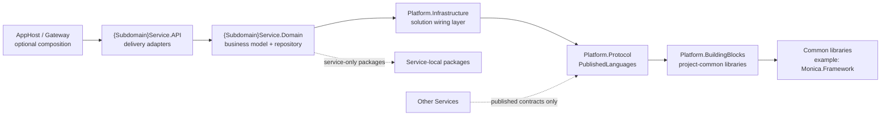

# Service Boundaries and Collaboration

Use these rules to keep the microservice architecture from collapsing into a distributed monolith.

## Ownership

- One subdomain service owns one business capability area and its persistence model.
- A service may expose contracts, but it does not expose its internal repository or infrastructure code.
- A service should not read or write another service's tables directly.

## Dependency Direction

- `{Subdomain}Service.API` references only `{Subdomain}Service.Domain`.
- `{Subdomain}Service.Domain` references only `Shared/Platform.Infrastructure/Platform.Infrastructure.csproj` from the shared platform chain.
- `Shared/Platform.Infrastructure/Platform.Infrastructure.csproj` references only `Shared/Platform.Protocol/Platform.Protocol.csproj`.
- `Shared/Platform.Protocol/Platform.Protocol.csproj` references only `Shared/Platform.BuildingBlocks/Platform.BuildingBlocks.csproj`.
- `Shared/Platform.Protocol/PublishedLanguages` may be referenced broadly as business contracts.
- A service's `Domain` stays private to that service.
- Cross-service collaboration happens through published requests, models, events, or explicitly chosen service interfaces.

## Library Reference Placement

- Put project-common library references in `Shared/Platform.BuildingBlocks`, such as shared Monica framework bundles or third-party extensions used by multiple services.
- Put service-only package references in the owning `{Subdomain}Service.Domain` project.
- Do not move a service-only repository implementation or adapter into shared `Platform` only to host its package references. `Platform.Infrastructure` is for cross-cutting solution wiring, not service ownership transfer.
- Keep the solution-project chain strict even when the service domain has extra local package references.

## Practical Boundaries

- Use a new service when the business capability has distinct language, lifecycle, or data ownership.
- Stay within the existing service when the new feature is just another use case inside the same subdomain.
- Avoid splitting a service solely by CRUD screens, endpoint count, or team preference.

## Adapter Rule

- The service `API` project and host entry points are delivery mechanisms.
- AppHost or gateway projects are composition-only entry points and should stay limited to the project file and `Program.cs`.
- They do not replace `ApplicationService`, `DomainService`, `Entity`, `Repository`, or other ProjectUnits.

## Solution View

- Keep `.slnx` folders aligned with the real `src/AppHost`, `src/Shared`, `src/Services`, and `src/Migrations` layout.
- Do not flatten services or migrations in the solution view in a way that hides service ownership boundaries.
