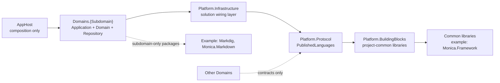

# Boundaries, Dependencies, and Persistence

Use these rules to keep the modular monolith clean instead of turning it into a global layered application.

## Dependency Direction

- `AppHost` entry projects reference only the composed `Domains.{Subdomain}.csproj` projects.
- `Domains.{Subdomain}.csproj` references only `Shared/Platform.Infrastructure/Platform.Infrastructure.csproj` from the shared platform chain.
- `Shared/Platform.Infrastructure/Platform.Infrastructure.csproj` references only `Shared/Platform.Protocol/Platform.Protocol.csproj`.
- `Shared/Platform.Protocol/Platform.Protocol.csproj` references only `Shared/Platform.BuildingBlocks/Platform.BuildingBlocks.csproj`.
- Domain-owned `Application` units depend on shared protocol contracts through their own domain package.
- `Domains.{Subdomain}.csproj` owns the domain's persistence and helper code.
- AppHost entry projects compose domains, but they should not absorb handlers, jobs, domain models, repositories, utility helpers, or extra shared platform references.

## Shared Platform Responsibilities

- `Platform.BuildingBlocks` is for project-agnostic infrastructure building blocks and third-party framework extensions.
- `Platform.Infrastructure` is for solution-owned infrastructure wiring, environment setup, and project-specific integration composition.
- `Platform.Protocol` is for the shared business language used across domains.

## Library Reference Placement

- Put project-common library references in `Platform.BuildingBlocks`, such as shared Monica framework bundles or third-party extensions used by multiple domains.
- Put subdomain-only package references in the owning `Domains.{Subdomain}.csproj`. If only one subdomain uses `Markdig`, `Monica.Markdown`, or a vendor SDK, that dependency stays with that subdomain.
- Do not move subdomain repository implementations or adapters into `Platform.Infrastructure` only to host their package references. `Platform.Infrastructure` is for cross-cutting solution wiring, not domain ownership transfer.
- Keep the solution-project chain strict even when the domain has extra local package references.

## Persistence Ownership

- Each domain owns its own persistence model, even when multiple domains share the same database engine.
- Keep `DbContext`, repository implementations, and EF mapping in `Repository/` inside the owning `Domains.{Subdomain}.csproj`.
- Do not create `Persistence/` as a default folder in this layout.
- Use the central migrator as an operational tool, not as an excuse to centralize domain ownership.

## Anti-Patterns

- Global `Application`, `Domain`, or `Infrastructure` folders containing mixed subdomains
- Separate `{Subdomain}.Application`, `{Subdomain}.Domain`, and `{Subdomain}.Infrastructure` projects when this layout already uses a merged domain package
- A separate `{Subdomain}.Contracts` project when `Platform.Protocol/PublishedLanguages` already owns the shared language
- Cross-domain references to another domain's repository or persistence implementation
- AppHost directly referencing `Platform.Infrastructure`, `Platform.Protocol`, or `Platform.BuildingBlocks` in this layout
- Moving a subdomain-only repository implementation into `Platform.Infrastructure` because it uses a package that only that subdomain needs
- AppHost entry projects that grow business handlers or jobs instead of staying composition-only
- Cross-domain references to another domain's `Application` handlers or internals
- `.slnx` files that flatten projects and ignore the `src/AppHost`, `src/Shared`, `src/Domains` layout
