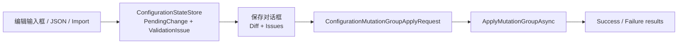

## Module options

`ModuleConfigurationUIOption` 当前没有公开配置属性。模块行为主要由 `Monica.Configuration` 的配置定义、active store bundle、runtime source chain 和 `ConfigurationFacade` 决定。

是否在来源清单中展示非受管配置项由核心模块选项控制：

```csharp
builder.AddMonica(monica =>
{
    monica.AddConfiguration(options =>
    {
        options.IncludeUnmanagedSourceInventoryItems = true;
    });
});
```

默认值为 `true`。关闭后，来源页面仍展示 provider 和 Monica-managed source chain，但不会列出非 Monica-managed runtime keys。

## 页面能力

| 页面 | 能力 |
|---|---|
| 配置状态 | 搜索配置定义和配置项、查看分组、查看 runtime effective value、显示外部来源 warning、编辑 scalar/complex/JSON、导入导出、保存 mutation group。 |
| 配置历史 | 查看单条 history、按组查看、按目标类型筛选、识别外部 source 修改、查看 diff timeline、回滚单条/多条/group。 |
| 配置 Debug | 查看当前 Microsoft configuration debug view。 |
| 配置来源 | 查看 active store bundle、provider order、source inventory、source contribution counts、JSON file view、read-only/writable 状态。 |

## 暂存模型

UI 修改值时不会立即写入 store 或 JSON 文件，而是进入 scoped `ConfigurationStateStore`。用户点击保存后，UI 才会：

1. 将暂存变更转换为一个 `ConfigurationMutationGroupApplyRequest`。
2. 调用 `ConfigurationFacade.ApplyMutationGroupAsync(...)`，由 Facade 统一完成校验、写入与审计记录。
3. 根据组结果展示成功项与失败项，然后清空已处理的 UI 暂存状态。



## Validation issue

无效编辑不会进入 `PendingChange`。它们会作为 `ConfigurationValidationIssue` 保存在 UI 状态中：

- 行内错误在输入焦点离开后仍会保留。
- 页脚会显示 validation issue 数量。
- 保存预览 dialog 会在 diff 和列表视图中展示错误值、错误原因、规则说明和跳转按钮。
- 只要存在 validation issue，最终保存按钮禁用。
- Undo row、Undo scope 和 Undo all 会清除对应 validation issue。

敏感字段的无效值会在预览和报告中脱敏。

## 正则输入体验

当配置节点由 `[OptionSetting(TextSemantic = ConfigurationTextSemantic.RegexPattern)]` 标记时，配置状态页会把它作为正则表达式输入处理：

- 输入框下方显示正则标识和转义预览，帮助用户识别它不是普通文本配置。
- `\d`、`\w`、`\s`、`\u4E00` 等转义会以高亮形式展示；明显不完整或不支持的转义会以错误样式提示。
- 保存前会使用 .NET 正则解析器校验整个 pattern。无效 pattern 会进入 validation issue，并阻止保存。
- 非 ASCII 字符会保持为正则兼容的 `\uXXXX` 形式；普通中文配置项不受影响。

敏感配置即使标记为正则，也不会在密码隐藏状态下显示转义预览，避免泄露用户正在输入的值。

## Source-aware editing

配置状态页显示的是当前 runtime effective value，而不是固定显示 Monica store 中的值。

| 当前生效来源 | UI 行为 |
|---|---|
| Monica effective store | 正常编辑，保存时写 Monica store。 |
| 可写 JSON file provider | 行内显示外部来源提示，保存时写对应 JSON 文件。 |
| 只读 JSON provider | 行变灰或禁用，提示文件不可写或无法解析 physical path。 |
| Environment variables / command line / memory / custom provider | 只读显示，提示该 provider 不支持人工修改。 |

如果编辑较低优先级 source 不会改变当前 runtime effective value，UI 会在来源编辑流程中提示这一点。

## 导入导出

配置状态页提供导入导出：

- **Export all**：导出所有 Monica-managed definitions。
- **Selected definition export**：只导出当前 definition。
- **Include sensitive**：显式选择后才把敏感值写入导出文件；默认 redacted。
- **Import**：上传导出文件，先显示报告，确认后暂存变更。

导入报告会展示：

| 项目 | 说明 |
|---|---|
| Changed | 可以暂存的变化。 |
| Unchanged | 与当前 effective value 相同，跳过。 |
| Unknown definition/path | 当前应用不认识，报告但跳过。 |
| Schema mismatch | schema version/hash 不一致，提示风险。 |
| Read-only source issue | 当前生效来源不可写，作为 issue 阻止保存。 |
| Validation error | 值不符合 schema/DataAnnotations，作为 issue 阻止保存。 |
| Redacted skip | 导出文件中被脱敏的路径，导入时保持当前值。 |

导入只负责把状态反填回配置状态页；最终持久化仍然通过保存 mutation group。

## JSON 编辑

UI 支持两种 JSON 编辑：

- **Definition-level JSON edit**：在当前配置定义上编辑整份 root JSON。
- **Complex-node JSON edit**：从复杂节点预览 dialog 进入，只编辑该 subtree。

JSON 编辑使用与导入相同的 draft/staging 管线：

1. 解析 JSON。
2. 按 schema 识别已知路径。
3. 跳过未变化值。
4. 报告未知 path、验证错误和只读 source。
5. 生成 diff preview。
6. 确认后写入 `ConfigurationStateStore`。

复杂节点编辑会尽量压缩为 container mutation，避免历史中出现大量叶子行。

## 敏感值显示

如果配置节点标记了 `[OptionSetting(IsSensitive = true)]`，UI 会把当前值作为敏感值处理：默认不展示明文，历史、source file view、导出文件和 effective value 视图也不会显示未脱敏内容。

敏感值脱敏不等于授权控制。页面访问权限应由宿主应用的认证授权策略负责。
