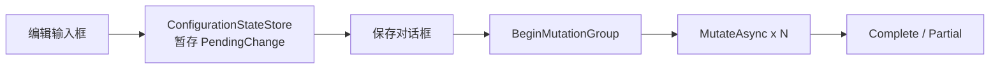

# Configuration

## Module options

`ModuleConfigurationUIOption` 当前没有公开配置属性。模块行为主要由 `Monica.Configuration` 的配置定义、active store bundle 和 `ConfigurationFacade` 决定。

## 页面能力

| 页面 | 能力 |
|---|---|
| 配置状态 | 搜索定义、查看 schema tree、编辑 scalar 值、暂存修改、保存 mutation group。 |
| 配置历史 | 查看历史行、查看 mutation group、触发回滚。 |
| 配置 Debug | 查看当前 Microsoft configuration debug view。 |
| 存储状态 | 查看 effective value、metadata、history store 和 notifier 状态。 |

## 暂存模型

UI 修改值时不会立即写入 store，而是进入 scoped `ConfigurationStateStore`。用户点击保存后，UI 才会：

1. 调用 `ConfigurationFacade.BeginMutationGroupAsync(...)`。
2. 对每条暂存变更调用 `ConfigurationFacade.MutateAsync(...)`。
3. 调用 `CompleteMutationGroupAsync(...)` 或 `MarkMutationGroupPartialAsync(...)`。
4. 清空 UI 暂存状态。

## 敏感值显示

如果配置节点标记了 `[OptionSetting(IsSensitive = true)]`，UI 会把当前值作为敏感值处理：默认不展示明文，历史和 effective value 视图也不会显示未脱敏内容。
