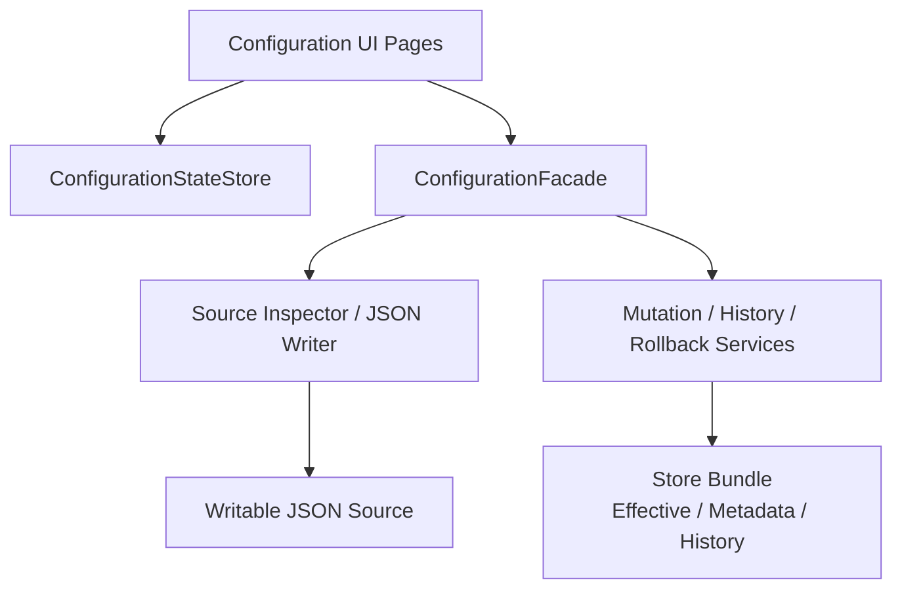

## Guide methods

| Method | What it enables | Required | Typical use |
|---|---|---|---|
| `monica.AddConfigurationUI()` | 注册配置操作台页面和页面状态服务 | 否 | 需要内置配置管理 UI 时。 |

`ModuleConfigurationUIGuide` 当前没有额外 Guide 方法。

## Module dependencies

| Dependency | Why it is used |
|---|---|
| `monica.AddConfiguration()` | 提供 `ConfigurationFacade`、schema、store、mutation、history、rollback 和 source inspection。 |
| `monica.AddLocalization()` | 注册 UI 本地化资源。 |
| `monica.AddDiffHighlight()` | 在历史、保存预览、JSON 编辑和导入报告中生成 diff。 |
| `monica.AddUIShell()` | 注册页面、导航和 Blazor shell。 |

## Store relationship

Configuration UI 不选择 store，也不直接写文件或数据库。它只调用 `ConfigurationFacade`。实际写入目标由当前 effective source 决定：

- `UseFileConfigurationStore(...)`：当 Monica provider 生效时写入本地 file store。
- `UseDbConfigurationStore(...)`：当 Monica provider 生效时写入 EF Core DB store，适合分布式。
- `AddManagedJsonFile(...)` 或其他可解析 JSON provider：当该 JSON source 是当前生效来源且可写时，写入对应物理 JSON 文件。
- `IConfigurationChangeNotifier`：如果宿主注册了实现，mutation 成功后会调用通知抽象。

## Source/status page

`/configuration/storage` 现在是配置来源和状态页面，不只是 store status。

它展示：

| 信息 | 来源 |
|---|---|
| Effective / metadata / history store | `GetStorageOverviewAsync()` |
| Store operation state | `GetStoreStatesAsync()` |
| Runtime provider order | `GetConfigurationSourcesAsync()` |
| 每个 source 提供的 key 数量和当前生效数量 | `GetConfigurationSourceInventoriesAsync()` |
| Monica-managed 与 unmanaged key 数量 | `ConfigurationSourceInventory` |
| JSON file view | `GetSourceFileViewAsync(...)` |
| Provider 是否 managed/writable/reloadOnChange/optional | `ConfigurationSourceDescriptor` |

页面按优先级从高到低展示 provider。对某个 source 打开详情时，可以看到它提供的配置项；当前生效的项会高亮。

## UI 与核心模块的边界

UI 只保留当前页面暂存状态。它不绕过 facade，不直接调用 store，也不把 validation issue 持久化。
