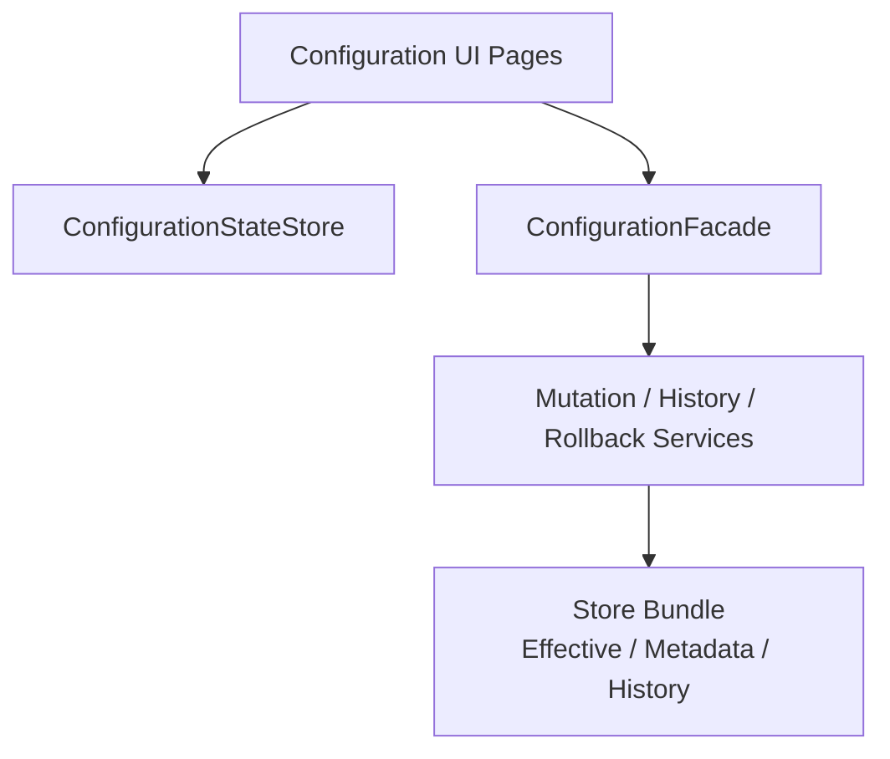

# Guide and Stores

## Guide methods

| Method | What it enables | Required | Typical use |
|---|---|---|---|
| `Mo.AddConfigurationUI()` | 注册配置操作台页面和页面状态服务 | 否 | 需要内置配置管理 UI 时。 |

`ModuleConfigurationUIGuide` 当前没有额外 Guide 方法。

## Module dependencies

| Dependency | Why it is used |
|---|---|
| `Mo.AddConfiguration()` | 提供 `ConfigurationFacade`、schema、store、mutation 和 history。 |
| `Mo.AddLocalization()` | 注册 UI 本地化资源。 |
| `Mo.AddUIShell()` | 注册页面、导航和 Blazor shell。 |

## Store relationship

Configuration UI 不选择 store，也不直接写文件或数据库。它只调用 `ConfigurationFacade`。实际写入目标由 `Monica.Configuration` 的 active store bundle 决定：

- `UseFileConfigurationStore(...)`：写入本地 file store。
- `UseDbConfigurationStore(...)`：写入 EF Core DB store，适合分布式。
- `IConfigurationChangeNotifier`：如果宿主注册了实现，mutation 成功后会调用通知抽象。

## UI 与核心模块的边界

