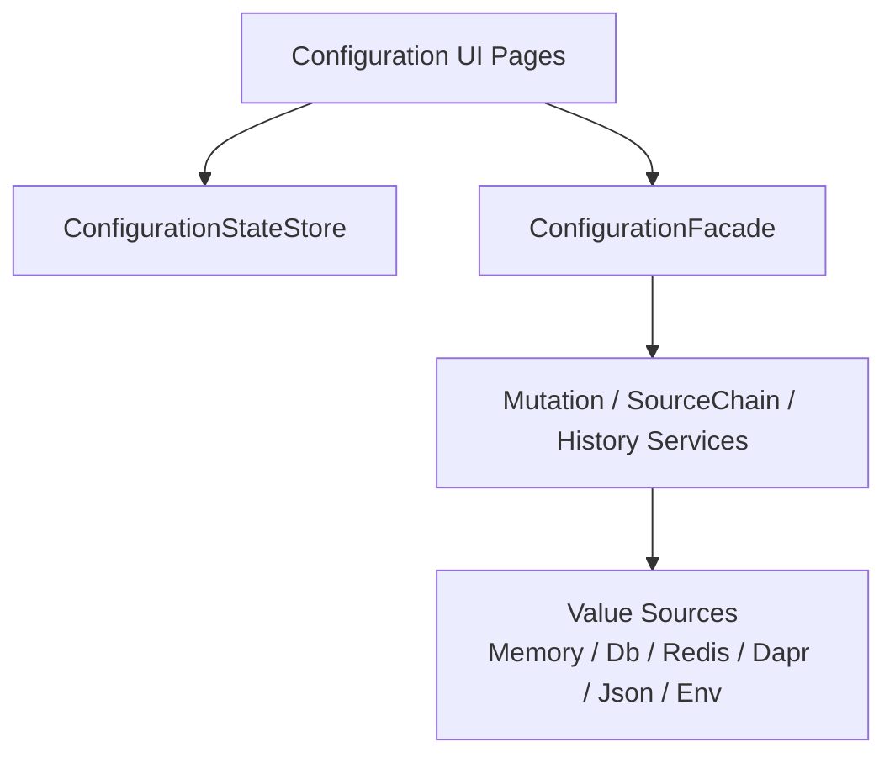

# Guide and Providers

## Guide methods

| Method | What it enables | Required | Typical use |
|---|---|---|---|
| `Mo.AddConfigurationUI()` | 注册配置操作台页面和页面状态服务 | 否 | 需要内置配置管理 UI 时。 |

`ModuleConfigurationUIGuide` 当前没有额外 Guide 方法。

## Module dependencies

| Dependency | Why it is used |
|---|---|
| `Mo.AddConfiguration()` | 提供 `ConfigurationFacade`、schema、provider、mutation 和 history。 |
| `Mo.AddLocalization()` | 注册 UI 本地化资源。 |
| `Mo.AddUIShell()` | 注册页面、导航和 Blazor shell。 |

## Provider relationship

Configuration UI 不选择 provider，也不直接写数据库或 Redis。它只调用 `ConfigurationFacade`。实际写入目标由 `Monica.Configuration` 的 value source 决定：

- 只注册核心模块时，默认写入 `memory:default`。
- 启用 Redis source 后，默认写入 Redis，除非请求指定其他 `TargetSourceKey`。
- 启用 EF Core source 后，默认写入数据库，并可查看历史。
- Dapr source 当前只读，UI 不会把 mutation 写入 Dapr Configuration store。

## UI 与核心模块的边界

