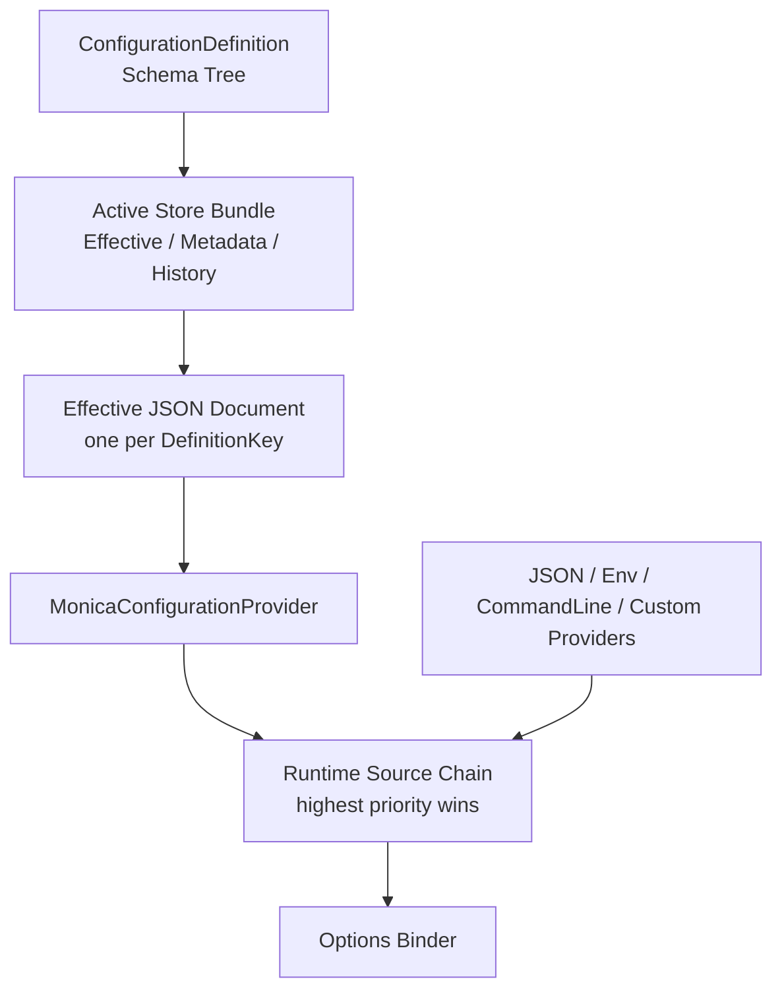
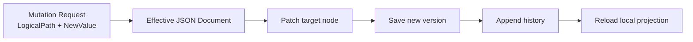

`Monica.Configuration` 的核心目标不是替代 Microsoft Configuration，而是在它前面增加一个更适合框架和业务模块使用的配置领域模型。开发者仍然通过 `IConfiguration` 和 Options Pattern 消费配置；配置定义、运行时修改、历史、导入导出和复杂类型规则由 Monica 管理。

## 三层模型

| 层 | 作用 | 典型对象 |
|---|---|---|
| Monica 配置领域层 | 管理 schema、effective value document、mutation、history、rollback、import/export 和 storage status | UI、API、Store provider、框架扩展 |
| Microsoft Configuration provider 层 | 按 provider 顺序组成 runtime source chain，最后提供 key 的 provider 生效 | `JsonConfigurationProvider`、env、command line、memory、Monica provider |
| Options 消费层 | 把最终 flat key/value 视图绑定到强类型 Options | `IConfiguration`、`IOptions<T>`、`IOptionsSnapshot<T>`、`IOptionsMonitor<T>` |



`appsettings*.json`、环境变量和 User Secrets 仍然属于宿主 bootstrap 配置。它们不是 Monica effective store 的一部分，但它们是 Microsoft `IConfiguration` provider，因此可以被 source inspection 显示。可解析的 JSON provider 还可以作为外部写入目标。

## ConfigurationDefinition

`ConfigurationDefinition` 是一个配置聚合根，通常对应一个 Options class。拥有该 CLR 类型的服务启动时通过反射扫描 schema，并把 metadata 发布到所选 store。

`DefinitionKey` 是跨服务、历史、mutation 和 UI 使用的稳定业务身份。不要只用类短名；推荐使用类似 `docs.portal.demo`、`mail.sender` 这种全局唯一且不容易随命名空间变化的 key。File store 会从该 key 计算固定 identity 文件名，而不会把原始 key 直接拼入路径。

发布到 metadata store 的 definition 是 portable 管理 schema，不依赖 owner service 的 assembly identity。owner service 会保留本地运行时需要的 CLR type identity，同时发布 `typeName` 风格的类型名、schema JSON 和 CLR 默认值 JSON。非 owner service 只要连接同一组 metadata / effective value / history store，就能读取 schema、校验 mutation，并修改共享 Monica effective document；它不需要持有对应 CLR options 类型。

## Active store bundle

当前版本不再让多个 Monica provider 互相做 source priority 合并。每个宿主只启用一个 active Monica store bundle，bundle 包含三类职责：

| Store | 作用 |
|---|---|
| `IConfigurationEffectiveValueReader` | 只读读取 Monica 管理的当前 effective JSON document；startup snapshot 只依赖该边界。 |
| `IConfigurationEffectiveValueStore` | 继承 reader，并负责创建和保存 effective JSON document。每个 `DefinitionKey` 对应一份完整 JSON document。 |
| `IConfigurationMetadataStore` | 保存发布后的 definition metadata 和 schema。 |
| `IConfigurationHistoryStore` | 保存 mutation group 和每次 mutation 的审计记录。 |

单体模式使用 file store；分布式模式使用 DB store。分布式不是 CRDT 式多主同步，而是“共享 store 作为事实源 + 多服务可作为 Monica effective store 写入口 + 本进程 reload + 后续通知扩展”。如果某个服务没有发布到 metadata store 的 definition，它不能猜测 schema，也不能修改该配置。

## Runtime source chain

Monica effective store 会被投影成一个 `MonicaConfigurationProvider`。从 Microsoft Configuration 的角度看，它只是 provider 链中的一环。

Provider 顺序仍遵守 .NET 规则：**后注册、优先级更高；最后提供某个 key 的 provider 生效。**


因此：

- Monica store 保存的是 Monica 管理层的 effective document。
- 运行时真正绑定到 Options 的值可能来自 Monica provider，也可能被更高优先级的 JSON、环境变量、命令行或自定义 provider 覆盖。
- UI 会按 source chain 展示每个配置项的来源，并高亮当前生效来源。
- 只有 Monica effective store 和可解析、可写的 JSON file provider 支持 UI mutation；env、command line、memory 和未知 provider 只读显示。

## Schema Tree

配置类会被扫描成 `ConfigurationNodeDefinition` 树。每个节点有结构类型：

| Node kind | 典型 CLR 类型 | 是否可以继续有子节点 |
|---|---|---|
| `Object` | 普通 options class | 是 |
| `Dictionary` | `Dictionary<string, T>` / `IDictionary<TKey, TValue>` | 通过 value template 继续 |
| `List` | `List<T>` / array / `IEnumerable<T>` | 通过 item template 继续 |
| `Scalar` | `string`、数值、`bool`、`enum`、`DateTime`、`TimeSpan`、`Uri` 等 | 否 |

`OptionSettingAttribute` 只描述 Monica 管理元数据，例如展示名、说明、敏感值、生效策略和列表项 key。校验规则优先复用 DataAnnotations，避免为配置系统再引入一套新的验证 attribute。

配置 schema 必须是有限树。直接或相互自引用，以及通过 nullable、list item 或 dictionary value 形成的当前分支递归都会在扫描阶段失败，并报告 logical path 与 CLR type chain；同一个类型在两个 sibling 分支中复用仍然合法。根节点 logical depth 为 `0`，最深允许 `64`，compact persisted schema JSON 的 parser/writer depth 上限为 `256`。持久化 schema 会先完成结构和 logical depth 校验，再重建 runtime definition。

## LogicalPath 与 IConfiguration path

`LogicalPath` 是配置管理使用的结构化路径。它由 segment 组成，不是业务代码应手写拼接的字符串。

| Segment | 代表含义 | Canonical 示例 |
|---|---|---|
| `PropertySegment("Services")` | 对象属性 | `Services` |
| `DictionaryKeySegment("billing")` | 字典 key | `Services[$billing]` |
| `ListItemKeySegment("main")` | 列表项稳定 key | `ConnectedDbs[#main]` |
| `ListIndexSegment(0)` | 投影和诊断用列表下标 | `ConnectedDbs[@0]` |

`$`、`#` 和 `@` 是 Monica canonical string 的标记：`$` 表示 dictionary key，`#` 表示 list item key，`@` 表示 list index。它们不是 Microsoft Configuration 规范。

投影到 Microsoft Configuration 时，Monica 会把结构化路径转换成冒号分隔 key，例如 `Demo:DocumentationRouting:Services:docs:DisplayName`。

## Effective JSON document

每个配置定义在 Monica store 中最终只保存一份 effective JSON document：

```text
metadata/definitions/{IDENTITY}.json
effective/{IDENTITY}.json
effective/.metadata/{IDENTITY}.metadata.json
```

`{IDENTITY}` 是对 invariant-uppercase `DefinitionKey` 的 UTF-8 内容计算得到的 64 位大写 SHA-256 十六进制值。大小写变体因此定位到同一组物理文件；definition metadata 和 effective metadata sidecar 会保留原始 key，并验证它与文件名 identity 一致。effective JSON 仍是独立、可人工编辑的文件。旧版按原始 key 命名的布局会在首次 store access 时被拒绝，必须先迁移或重建；Monica 不自动迁移或删除旧文件。

DB mode 则在 effective value table 中保存一行 document。修改叶子节点时，Monica 会 patch 这份 JSON 文档中的目标位置，而不是维护一组内部来源优先级 override。

首次创建 effective document 时，owner service 会使用本地 CLR 默认值和当前 `IConfiguration` 叠加生成 seed。非 owner service 无法实例化 owner 的 CLR options 类型时，会使用 metadata store 中的 owner-published default JSON，再叠加当前进程本地 `IConfiguration` 中可读到的值。因此 owner 和 non-owner 的第一次 Monica effective store mutation 使用同一套 schema 与默认值语义。



如果当前生效来源不是 Monica provider，而是可写 JSON provider，owner service 可以对那个 JSON 文件执行 source-targeted mutation。该操作仍会写入 Monica history，但历史目标是 `ExternalConfigurationSource`。这不是跨服务分布式写入能力；非 owner service 应写共享 Monica effective store，或把 source mutation 路由到 source owner。

## 启动参数与运行期 Options

模块图组合发生在应用构建前。连接配置 store、完成数据库 migration、初始化日志等“读取 store 本身所需”的参数必须直接来自 `builder.Configuration`，因为它们先于 Monica-managed provider 可用。

如果某个已管理 Option 必须在这时驱动宿主拓扑，同一份 `MonicaConfigurationInputPlan` 可以通过 `BuildBootstrapConfiguration(...)` 和 `LoadEffectiveOptionsSnapshot[Async](...)` 返回一次 point-in-time 观察。它只读一次有序 batch，按 host configuration → stored Monica document 或内存 seed → managed JSON 的优先级绑定值，不发布 definition，也不持久化缺失 document。reader、取消、JSON、projection 或 binding failure 都会终止启动，只有 document 缺失才使用 seed。

该快照与稍后的 runtime configuration 之间没有一致性屏障；store edit、purge 或 runtime activation 生成不同 seed 后，值可以不同。拓扑字段应声明 `StaticAfterStartup` 或 `RequiresRestart`。应用构建完成后，业务服务仍通过 `IOptions<T>`、`IOptionsSnapshot<T>` 或 `IOptionsMonitor<T>` 消费 `[Configuration]` 类型，而不是提前构建临时 DI 容器。

## List 的稳定身份

Microsoft Configuration 最终绑定 list 时必须使用数字下标，例如 `ConnectedDbs:0`。但下标不适合作为运行时修改身份，因为插入、删除或排序都会改变 index。

Monica 推荐给 list item 类型选一个稳定 scalar 属性：

```csharp
public sealed class ConnectedDbOptions
{
    [Required]
    [OptionSetting("Name", IsListItemKey = true)]
    public string Name { get; set; } = "";

    [Required]
    [OptionSetting("Connection String", IsSensitive = true)]
    public string ConnectionString { get; set; } = "";
}
```

mutation 使用 `ConnectedDbs[#main]` 定位。进入 Microsoft Configuration 绑定视图时，列表项 key 会被解析为 `ConnectedDbs:0`、`ConnectedDbs:1` 等 index。没有稳定 key 的 list 仍然可以整体替换，但不适合按项修改。

## Mutation、History 与 Rollback

配置修改统一经过 `ConfigurationFacade`。Mutation service 会：

1. 根据 `DefinitionKey` 加载 schema 和目标存储。
2. 用 `LogicalPath` patch Monica effective document，或在本服务拥有本地 definition 且 source 可写时，用 projected configuration path patch 外部 JSON source。
3. 用 DataAnnotations 和 schema 规则校验。
4. 增加 document version 或 source revision。
5. 写入 history。
6. reload 本进程的 `MonicaConfigurationProvider`。
7. 如果注册了 `IConfigurationChangeNotifier`，调用通知抽象。

`ConfigurationMutationGroup` 是一组修改的审计单位。Rollback 不是绕过规则直接改存储，而是根据历史记录构造反向 mutation，再走同一套校验、写入、reload 和通知流程。

复杂节点、definition-level JSON edit 和 import staging 会把大量叶子变更压缩成 container mutation。例如编辑 `Services` 时，历史默认显示一条 `Set Services`，细节通过 diff 查看。

## Import、Export 与 JSON Edit

Configuration UI 提供一个可复用的 JSON draft/staging 管线：

- **Export**：把当前 runtime effective values 导出成 versioned JSON package。敏感值默认 redacted，导出文件记录 `redactedPaths`。
- **Import**：读取导出文件，报告未知 definition/path、schema mismatch、只读来源、验证错误和未变化值。确认后只暂存可保存变更，最终仍通过保存修改组提交。
- **JSON Edit**：按 definition 或复杂节点编辑 JSON，使用同一套解析、校验、diff 和暂存逻辑。

导入和 JSON edit 都会以当前生效且可写的 source 作为目标。如果当前值来自只读 provider，UI 会把它报告为 validation issue，而不是悄悄写回 Monica store 造成误导。

## Reload Behavior

`ConfigurationReloadBehavior` 描述修改后如何被运行实例观察：

| Behavior | 语义 |
|---|---|
| `OnlineReloadable` | 运行进程 reload 配置后可以观察到新值。 |
| `RequiresRestart` | 修改可保存，但进程需要重启才能安全观察新值。 |
| `StaticAfterStartup` | 该值设计上只应在启动阶段读取，运行期修改不应被当成热更新。 |
| `Inherit` | 节点继承父级或 definition 的设置。 |

`RequiresRestart` 和 `StaticAfterStartup` 都会在 UI 中提示重启影响，但前者是“修改后需要重启”，后者是“这个配置本身属于启动期静态输入”。

## Sensitive Values

敏感值由 `[OptionSetting(IsSensitive = true)]` 标记。UI 和 facade 返回 display-safe 结果，不暴露明文。

`IsSensitive` 不是授权系统。它只负责展示脱敏和编辑体验；谁能查看或修改配置仍应由宿主应用的认证授权策略控制。

当前 v1 store 不实现字段级密文 payload 或外部 secret reference。敏感值若写入 effective JSON document 或外部 JSON 文件，其静态安全性由存储与部署环境负责；需要外部密钥管理的值应继续作为 bootstrap/secret 输入保留在 Monica 管理范围之外。
