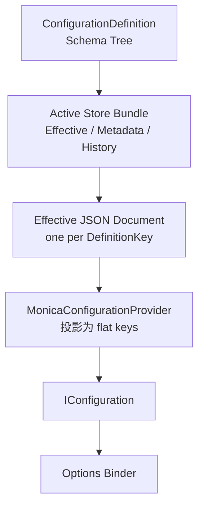
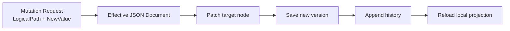

# Concepts

`Monica.Configuration` 的核心目标不是替代 Microsoft Configuration，而是在它前面增加一个更适合框架和微服务使用的配置领域模型。开发者仍然通过 `IConfiguration` 和 Options Pattern 消费配置；配置定义、运行时修改、历史和复杂类型规则由 Monica 管理。

## 两层模型

Monica 把配置分成两层：

| 层 | 作用 | 面向对象 |
|---|---|---|
| Monica 配置领域层 | 管理 schema、effective value document、mutation、history、storage status 和敏感值 | UI、API、Store provider、框架扩展 |
| Microsoft Configuration 层 | 提供 flat key/value 视图并绑定到 Options | `IConfiguration`、`IOptions<T>`、`IOptionsSnapshot<T>`、`IOptionsMonitor<T>` |



`appsettings*.json`、环境变量和 User Secrets 只作为 bootstrap/seed 输入。它们不是 Monica 运行期纳管的 source，也不会出现在 storage priority 中。

## ConfigurationDefinition

`ConfigurationDefinition` 是一个配置聚合根，通常对应一个 Options class。拥有该 CLR 类型的服务启动时通过反射扫描 schema，并把 metadata 发布到所选 store。

`DefinitionKey` 是跨服务、历史、mutation、文件名和 UI 使用的稳定身份。不要只用类短名；推荐使用类似 `docs.portal.demo`、`mail.sender` 这种全局唯一且不容易随命名空间变化的 key。

## Active store bundle

当前版本只有一个 active store bundle，不再做多来源优先级合并。bundle 包含三类职责：

| Store | 作用 |
|---|---|
| `IConfigurationEffectiveValueStore` | 保存当前最终配置值。每个 `DefinitionKey` 对应一份完整 JSON document。 |
| `IConfigurationMetadataStore` | 保存发布后的 definition metadata 和 schema。 |
| `IConfigurationHistoryStore` | 保存 mutation group 和每次 mutation 的审计记录。 |

单体模式使用 file store；分布式模式使用 DB store。分布式不是 CRDT 式多主同步，而是“共享 DB 作为事实源 + 多服务可作为写入口 + 本进程 reload + 后续通知扩展”。

## Schema Tree

配置类会被扫描成 `ConfigurationNodeDefinition` 树。每个节点有结构类型：

| Node kind | 典型 CLR 类型 | 是否可以继续有子节点 |
|---|---|---|
| `Object` | 普通 options class | 是 |
| `Dictionary` | `Dictionary<string, T>` / `IDictionary<TKey, TValue>` | 通过 value template 继续 |
| `List` | `List<T>` / array / `IEnumerable<T>` | 通过 item template 继续 |
| `Scalar` | `string`、数值、`bool`、`enum`、`TimeSpan` 等 | 否 |

`OptionSettingAttribute` 只描述 Monica 管理元数据，例如展示名、说明、敏感值、生效策略和列表项 key。校验规则优先复用 DataAnnotations，避免为配置系统再引入一套新的验证 attribute。

## LogicalPath 与 IConfiguration path

`LogicalPath` 是配置管理使用的结构化路径。它由 segment 组成，不是业务代码应手写拼接的字符串。

| Segment | 代表含义 | Canonical 示例 |
|---|---|---|
| `PropertySegment("Services")` | 对象属性 | `Services` |
| `DictionaryKeySegment("billing")` | 字典 key | `Services[$billing]` |
| `ListItemKeySegment("main")` | 列表项稳定 key | `ConnectedDbs[#main]` |
| `ListIndexSegment(0)` | 投影和诊断用列表下标 | `ConnectedDbs[@0]` |

`$`、`#` 和 `@` 是 Monica canonical string 的标记：`$` 表示 dictionary key，`#` 表示 list item key，`@` 表示 list index。它们不是 Microsoft Configuration 规范，也不是 Dapr 规范。

## Effective JSON document

每个配置定义最终只保存一份 effective JSON document：

```text
effective/{DefinitionKey}.json
```

或 DB 中的一行 document。修改叶子节点时，Monica 会 patch 这份 JSON 文档中的目标位置，而不是维护一组来源优先级 override。



这种模型牺牲了一些“多来源解释能力”，但显著降低复杂度：UI、API、Options 绑定和历史都围绕同一个最终 JSON document 工作。

## List 的稳定身份

Microsoft Configuration 最终绑定 list 时必须使用数字下标，例如 `ConnectedDbs:0`。但下标不适合作为运行时修改身份，因为插入、删除或排序都会改变 index。

Monica 推荐给 list item 类型选一个稳定 scalar 属性：

```csharp
public sealed class ConnectedDbOptions
{
    [Required]
    [OptionSetting("Name", IsListItemKey = true)]
    public string Name { get; set; } = "";

    [Required]
    [OptionSetting("Connection String", IsSensitive = true)]
    public string ConnectionString { get; set; } = "";
}
```

mutation 使用 `ConnectedDbs[#main]` 定位。进入 Microsoft Configuration 绑定视图时，列表项 key 会被解析为 `ConnectedDbs:0`、`ConnectedDbs:1` 等 index。没有稳定 key 的 list 仍然可以整体替换，但不适合按项修改。

## Mutation、History 与 Rollback

配置修改统一经过 `ConfigurationFacade.MutateAsync(...)`。Mutation service 会：

1. 根据 `DefinitionKey` 加载 schema 和 effective document。
2. 用 `LogicalPath` patch JSON document。
3. 用 DataAnnotations 和 schema 规则校验。
4. 增加 document version 并保存。
5. 写入 history。
6. reload 本进程的 `MonicaConfigurationProvider`。
7. 如果注册了 `IConfigurationChangeNotifier`，调用通知抽象。

`ConfigurationMutationGroup` 是一组修改的审计单位。Rollback 不是绕过规则直接改存储，而是根据历史记录构造反向 mutation，再走同一套校验、写入、reload 和通知流程。

## Reload Behavior

`ConfigurationReloadBehavior` 描述修改后如何被运行实例观察：

| Behavior | 语义 |
|---|---|
| `OnlineReloadable` | 运行进程 reload 配置后可以观察到新值。 |
| `RequiresRestart` | 修改可保存，但进程需要重启才能安全观察新值。 |
| `StaticAfterStartup` | 该值设计上只应在启动阶段读取，运行期修改不应被当成热更新。 |
| `Inherit` | 节点继承父级或 definition 的设置。 |

`RequiresRestart` 和 `StaticAfterStartup` 都会在 UI 中提示重启影响，但前者是“修改后需要重启”，后者是“这个配置本身属于启动期静态输入”。

## Sensitive Values

敏感值由 `[OptionSetting(IsSensitive = true)]` 标记。UI 和 facade 返回 display-safe 结果，不暴露明文。

`IsSensitive` 不是授权系统。它只负责展示脱敏和编辑体验；谁能查看或修改配置仍应由宿主应用的认证授权策略控制。
