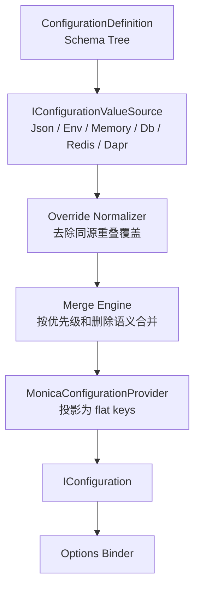
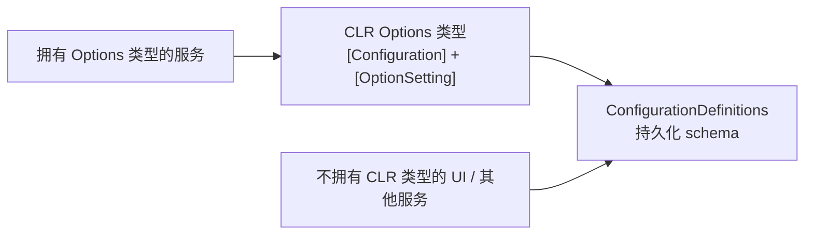
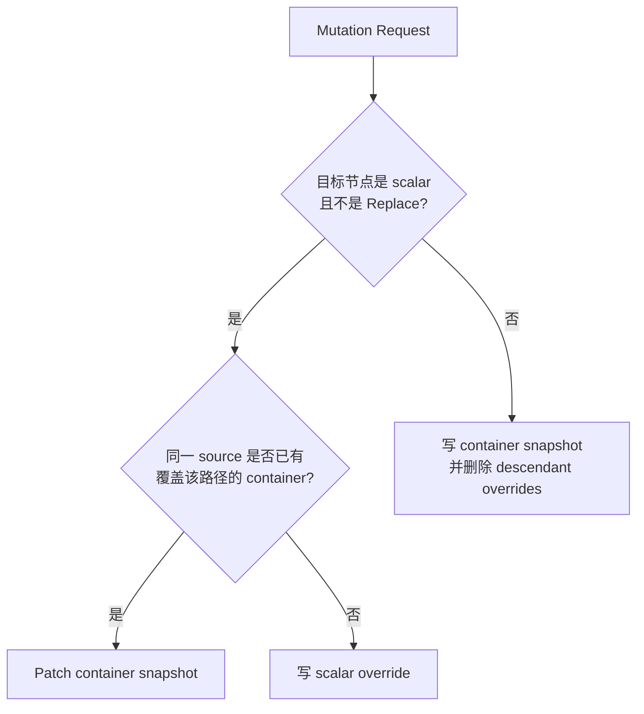
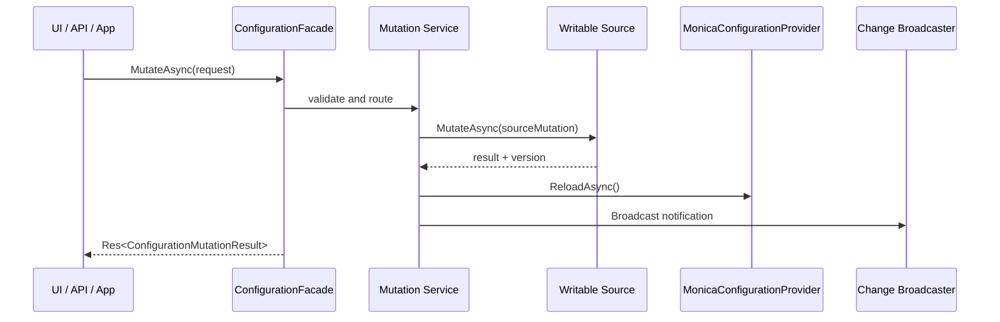

# Concepts

`Monica.Configuration` 的核心目标不是替代 Microsoft Configuration，而是在它前面增加一个更适合框架和微服务使用的配置领域模型。开发者仍然通过 `IConfiguration` 和 Options Pattern 消费配置；配置定义、运行时修改、来源链路、历史和复杂类型规则由 Monica 管理。

## 两层模型

Monica 把配置分成两层：

| 层 | 作用 | 面向对象 |
|---|---|---|
| Monica 配置领域层 | 管理 schema、来源、合并、mutation、history、source chain 和敏感值 | UI、API、Provider、框架扩展 |
| Microsoft Configuration 层 | 提供 flat key/value 视图并绑定到 Options | `IConfiguration`、`IOptions<T>`、`IOptionsSnapshot<T>`、`IOptionsMonitor<T>` |



这样设计的原因是：原生 `IConfigurationProvider` 只提供 key/value 层级视图，不表达“配置定义是什么”“这个复杂对象的稳定身份是什么”“删除了某个子树”“哪个来源生效”“历史如何回滚”等配置管理概念。

当前 `Mo.AddConfiguration()` 会完成 schema 扫描、Options 绑定、配置源、mutation、history 和 UI facade 的注册。`MonicaConfigurationProvider` 是核心模块提供的投影 provider；如果宿主需要让运行时 override 直接进入 Microsoft `IConfiguration` 绑定视图，需要额外完成投影 provider 的宿主接入。也就是说，配置管理能力已经可以通过 `ConfigurationFacade` 和 UI 使用，但“mutation 后立刻影响所有 `IOptionsSnapshot<T>`”取决于宿主是否把 Monica 投影接入到 `IConfiguration` provider 链。

## ConfigurationDefinition

`ConfigurationDefinition` 是一个配置聚合根，通常对应一个 Options class。拥有该 CLR 类型的服务启动时通过反射扫描 schema；如果启用了 EF Core provider，它会把 schema 发布到数据库。

对于拥有类型的服务，CLR 类型是 schema 事实源；对于不拥有类型的服务，例如单独的配置 UI Host，持久化的 `ConfigurationDefinition` 记录就是读取和修改配置的 schema 事实源。



`DefinitionKey` 是跨服务、历史、mutation 和 UI 使用的稳定身份。不要只用类短名；推荐使用类似 `docs.portal.demo`、`mail.sender` 这种全局唯一且不容易随命名空间变化的 key。

## Schema Tree

配置类会被扫描成 `ConfigurationNodeDefinition` 树。每个节点有结构类型：

| Node kind | 典型 CLR 类型 | 是否可以继续有子节点 |
|---|---|---|
| `Object` | 普通 options class | 是 |
| `Dictionary` | `Dictionary<string, T>` / `IDictionary<TKey, TValue>` | 通过 value template 继续 |
| `List` | `List<T>` / array / `IEnumerable<T>` | 通过 item template 继续 |
| `Scalar` | `string`、数值、`bool`、`enum`、`TimeSpan` 等 | 否 |

`OptionSettingAttribute` 只描述 Monica 管理元数据，例如展示名、说明、敏感值、生效策略和列表项 key。校验规则优先复用 DataAnnotations，避免为配置系统再引入一套新的验证 attribute。

## LogicalPath 与 IConfiguration path

`LogicalPath` 是配置管理使用的结构化路径。它由 segment 组成，不是业务代码应手写拼接的字符串。

| Segment | 代表含义 | Canonical 示例 |
|---|---|---|
| `PropertySegment("Services")` | 对象属性 | `Services` |
| `DictionaryKeySegment("billing")` | 字典 key | `Services[$billing]` |
| `ListItemKeySegment("main")` | 列表项稳定 key | `ConnectedDbs[#main]` |
| `ListIndexSegment(0)` | 投影和诊断用列表下标 | `ConnectedDbs[@0]` |

`LogicalPath` 用于 mutation、history、source chain 和 UI 定位。`IConfiguration` path 用冒号分隔，例如 `Demo:Gateway:Services:billing:ConnectedDbs:0:ConnectionString`，它用于 Microsoft binder 绑定。


`$`、`#` 和 `@` 是 canonical string 的标记：`$` 表示 dictionary key，`#` 表示 list item key，`@` 表示 list index。它们不是 Microsoft Configuration 规范，也不是 Dapr 规范；它们只属于 Monica 的逻辑路径格式。

## Source Chain

每个 `IConfigurationValueSource` 都声明自己的 `SourceKey`、类型、优先级、是否可写、是否支持历史。合并时优先级高的来源先参与生效值选择。

默认来源：

| Source | Priority | Writable | 说明 |
|---|---:|---|---|
| Json | `1` | 否 | 从宿主 `IConfiguration` 的 JSON 配置读取已知 leaf。 |
| Environment | `10` | 否 | 从环境变量读取已知 leaf。 |
| Memory | `100` | 是 | 默认运行时写入来源，适合开发和演示。 |

可选来源：

| Source | Priority | Writable | 说明 |
|---|---:|---|---|
| Dapr Configuration | `50` | 否 | 从 Dapr Configuration API 读取 leaf。 |
| Redis | `150` | 是 | Redis-backed override store 和 pub/sub 通知。 |
| Database | `200` | 是 | EF Core-backed definition、override、history、mutation group。 |

`ConfigurationSourceChain` 会列出一个逻辑路径上所有来源的值，并通过 `EffectiveSourceKey` 标出最终生效来源。敏感节点不会把明文值返回给 UI。

## Override 与 Container Snapshot

运行时修改不会直接改原始 `appsettings.json` 或 `IConfiguration`。它会写入某个可写 source 的 override。

Override 有两种粒度：

| Granularity | 存什么 | 适合什么操作 |
|---|---|---|
| `Scalar` | 一个叶子 JSON 值 | 修改普通字符串、数字、布尔值等 leaf。 |
| `Container` | 一个 object、dictionary 或 list 的 JSON 快照 | 新增复杂对象、替换对象、替换字典、替换列表。 |

同一个 source 内必须保持一个不变量：**一个 active container snapshot 下面不能同时存在 active descendant leaf override**。如果已经有 `Services[$billing]` 的 container snapshot，再修改 `Services[$billing].ConnectedDbs[#main].ConnectionString`，source 应 patch 这个 snapshot，而不是再写一条子 leaf。



## List 的稳定身份

Microsoft Configuration 最终绑定 list 时必须使用数字下标，例如 `ConnectedDbs:0`。但下标不适合作为运行时修改身份，因为插入、删除或排序都会改变 index。

Monica 推荐给 list item 类型选一个稳定 scalar 属性：

```csharp
public sealed class ConnectedDbOptions
{
    [Required]
    [OptionSetting("Name", IsListItemKey = true)]
    public string Name { get; set; } = "";

    [Required]
    [OptionSetting("Connection String", IsSensitive = true)]
    public string ConnectionString { get; set; } = "";
}
```

mutation 使用 `ConnectedDbs[#main]` 定位。进入 Microsoft Configuration 绑定视图时，列表项 key 会被解析为 `ConnectedDbs:0`、`ConnectedDbs:1` 等 index。没有稳定 key 的 list 仍然可以整体替换，但不适合按项修改。

列表重排主要发生在投影阶段：如果值来自 container snapshot，Monica 保留 snapshot 中的数组顺序；如果值只来自 path 中的 list item key，Monica 按 item key 的稳定顺序生成 index。

## Mutation Pipeline

配置修改统一经过 `ConfigurationFacade.MutateAsync(...)` 和内部 mutation service：



`ExpectedSchemaVersion` 用来避免客户端拿旧 schema 修改新配置。`ExpectedValueVersion` 用来做乐观并发控制。未指定 `TargetSourceKey` 时，mutation 会写入优先级最高的 writable source。

Mutation 成功后会调用 reload coordinator。只有当宿主已经创建并接入 `MonicaConfigurationProvider` 时，这个 reload 才会刷新 Microsoft Configuration 投影；否则它只影响 Monica 管理视图中的来源值、历史和审计记录。

## History、Mutation Group 与 Rollback

`ConfigurationMutationGroup` 是一组修改的审计单位。UI 暂存多个变更后，会先创建 group，再逐条执行 mutation，最后把 group 标记为 `Applied` 或 `PartiallyApplied`。

只有实现 `IConfigurationHistorySource` 的 provider 才能提供持久历史。当前 EF Core provider 支持 history；默认 memory source 和 Redis source 不提供持久历史。

Rollback 不是绕过规则直接改库，而是根据历史记录构造反向 mutation，再走同一套校验、写入、reload 和通知流程。

## Reload Behavior

`ConfigurationReloadBehavior` 描述修改后如何被运行实例观察：

| Behavior | 语义 |
|---|---|
| `OnlineReloadable` | 运行进程 reload 配置后可以观察到新值。 |
| `RequiresRestart` | 修改可保存，但进程需要重启才能安全观察新值。 |
| `StaticAfterStartup` | 该值设计上只应在启动阶段读取，运行期修改不应被当成热更新。 |
| `Inherit` | 节点继承父级或 definition 的设置。 |

`RequiresRestart` 和 `StaticAfterStartup` 都会在 UI 中提示重启影响，但前者是“修改后需要重启”，后者是“这个配置本身属于启动期静态输入”。

## Sensitive Values

敏感值由 `[OptionSetting(IsSensitive = true)]` 标记。Mutation service 会用 ASP.NET Core Data Protection 把 plain JSON payload 转为 `ProtectedJson`；source chain、effective value 和 UI 展示使用 display-safe 结果，不暴露明文。

`IsSensitive` 不是授权系统。它只负责存储保护和展示脱敏；谁能查看或修改配置仍应由宿主应用的认证授权策略控制。
