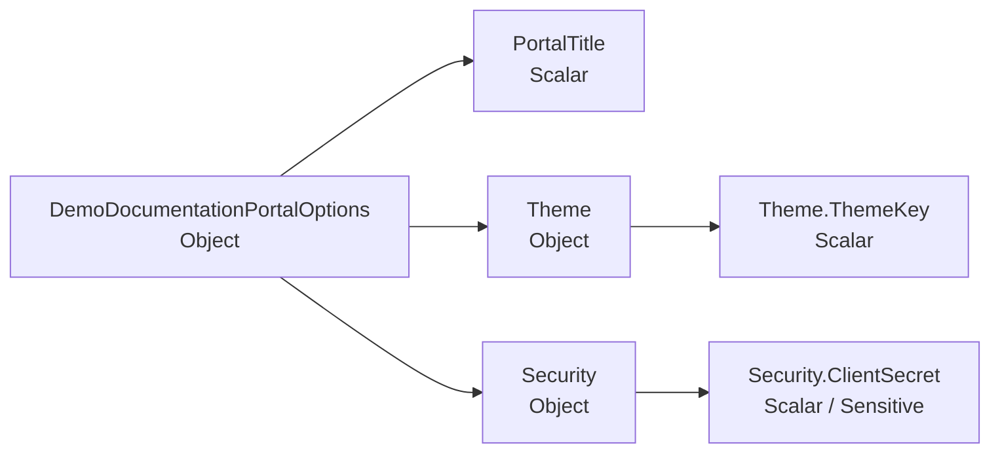
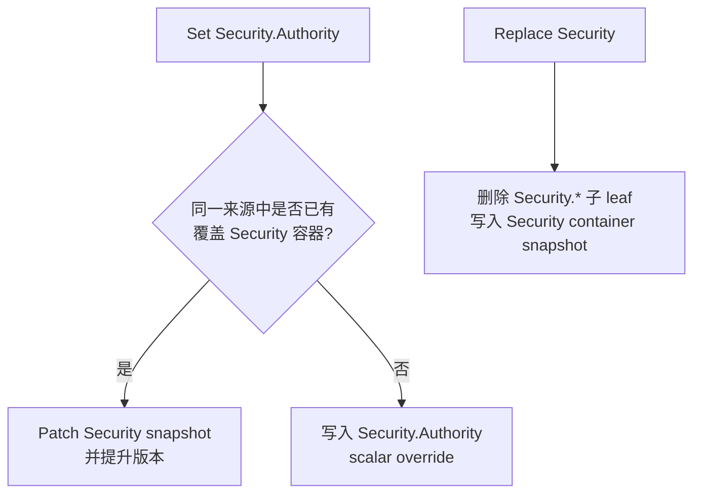

# Configuration

`ModuleConfigurationOption` 当前没有公开配置属性。模块的核心配置方式不是设置模块 option，而是在 Options 类型上使用 `[Configuration]` 和 `[OptionSetting]` 声明 schema。

## 配置定义

一个带 `[Configuration]` 的类会变成一个 `ConfigurationDefinition`。

| 字段 | 来源 | 说明 |
|---|---|---|
| `DefinitionKey` | `[Configuration].DefinitionKey`，未设置时使用 CLR 全名 | 稳定唯一身份。跨服务、历史、UI 和 mutation 都使用它。 |
| `SectionPath` | 构造参数或 `[Configuration].SectionPath`，未设置时由 definition key 替换 `.` 为 `:` | Microsoft `IConfiguration` 的绑定根路径。 |
| `DisplayName` | `[Configuration].DisplayName`，未设置时使用类型名 | UI 展示名，可以重复。 |
| `ClrTypeName` | 扫描到的 Options 类型 | 诊断和跨服务 schema 识别使用。 |
| `OwnerModule` | `[Configuration].OwnerModule` | UI 分组和责任归属。 |
| `Category` | `[Configuration].Category` | 业务自定义分类。 |
| `ReloadBehavior` | `[Configuration].ReloadBehavior` | 默认生效策略，节点可覆盖。 |
| `SchemaHash` | 由扫描器计算 | 用于识别 schema 漂移。 |

```csharp
[Configuration(
    "Demo:DocumentationPortal",
    DefinitionKey = "docs.portal.demo",
    DisplayName = "Docs Portal Demo",
    OwnerModule = "Documentation",
    Category = "Demo",
    ReloadBehavior = ConfigurationReloadBehavior.OnlineReloadable)]
public sealed class DemoDocumentationPortalOptions
{
}
```

## 配置节点

配置类会被扫描成一棵 `ConfigurationNodeDefinition` 树。节点类型由 CLR 类型推导：

| CLR 形态 | Node kind | 说明 |
|---|---|---|
| 普通 object | `Object` | 继续扫描公开实例属性。 |
| `IDictionary<TKey, TValue>` | `Dictionary` | key 作为字典项身份，value 作为模板节点。 |
| `IEnumerable<T>` / array | `List` | item 作为模板节点。带稳定 key 的 list 支持按项修改。 |
| `string`、数值、`bool`、`enum`、`DateTime`、`TimeSpan`、`Uri`、`Guid` 等 | `Scalar` | 作为叶子值参与读取、修改和投影。 |



## OptionSetting

`[OptionSetting]` 只承载 Monica 的管理元数据，不替代 DataAnnotations。

| 属性 | 默认值 | 用途 |
|---|---|---|
| `NodeKey` | 当前 `LogicalPath` 的 canonical 字符串 | 给节点一个稳定身份，适合未来属性重命名。 |
| `DisplayName` | `null` | UI 展示名。 |
| `Description` | `null` | UI、文档和说明弹窗使用。 |
| `IsSensitive` | `false` | 敏感值在来源链路、历史和 UI 中脱敏，写入时会被保护。 |
| `ReloadBehavior` | `Inherit` | 覆盖定义级生效策略。 |
| `IsListItemKey` | `false` | 标记列表项内唯一的稳定 key 属性。每个 item 类型最多一个。 |

## 验证规则

配置验证直接复用 .NET DataAnnotations。扫描器会把常见验证注解转换成 `ConfigurationValidationRule`，供 UI 展示和编辑器本地校验使用；Options 绑定后仍会调用 `ValidateDataAnnotations()`。

| DataAnnotation | Monica rule |
|---|---|
| `[Required]` | `RequiredRule` |
| `[Range]` | `RangeRule` |
| `[RegularExpression]` | `RegexRule` |
| `[MaxLength]` | `MaxLengthRule` |
| `[MinLength]` | `MinLengthRule` |
| `[StringLength]` | `MaxLengthRule` |

当前 mutation 服务已经校验 `ExpectedSchemaVersion`，DataAnnotations 的完整服务端 mutation 校验会随后补齐。生产界面仍应把 UI 本地校验视为体验优化，而不是权限或数据完整性的唯一边界。

## LogicalPath

`LogicalPath` 是配置管理的稳定路径，不是简单字符串 DSL。它由结构化 segment 组成：

| Segment | 用途 | 示例 canonical |
|---|---|---|
| `PropertySegment` | 对象属性 | `Security.Authority` |
| `DictionaryKeySegment` | 字典 key | `Services[$billing]` |
| `ListItemKeySegment` | 带稳定 key 的 list item | `ConnectedDbs[#main]` |
| `ListIndexSegment` | 投影和诊断用 list index | `ConnectedDbs[@0]` |

`$` 表示 dictionary key，`#` 表示 list item key，`@` 表示 list index。它们是 Monica canonical path 的显示和存储约定；在代码内应优先使用 `LogicalPath` 和 segment 类型，而不是手写字符串。

## 复杂类型和存储粒度

Monica 支持两种覆盖粒度：

| Granularity | 适用对象 | 行为 |
|---|---|---|
| `Scalar` | 标量叶子 | 只保存一个叶子的 JSON 值。 |
| `Container` | object、dictionary、list 或 replace 操作 | 保存一个容器快照 JSON。 |

当一个容器已经以 snapshot 形式存在时，修改其内部叶子不会再额外写一条 leaf 覆盖，而是 patch 那个容器 snapshot。这样可以避免同一个来源中“父容器快照”和“子叶子覆盖”重叠造成歧义。



## List 和 Dictionary

Dictionary 天然使用 key 作为身份。为了能稳定修改 list item，列表项类型应选择一个公开 scalar 属性并标记 `IsListItemKey = true`。

```csharp
public sealed class ConnectedDbOptions
{
    [Required]
    [OptionSetting("Name", IsListItemKey = true)]
    public string Name { get; set; } = "";

    [Required]
    [OptionSetting("Connection String", IsSensitive = true)]
    public string ConnectionString { get; set; } = "";
}
```

没有稳定 item key 的 list 仍然可以整体替换，但不适合按项做精确 mutation。`ListIndexSegment` 只用于 projection 和诊断，mutation 请求不能使用它。

## 敏感值

敏感值由 `[OptionSetting(IsSensitive = true)]` 声明。Mutation 服务在写入前会保护 payload；来源链路和有效值读取会返回 display-safe 值，不会把敏感内容明文暴露给 UI。

存储值支持三种形态：

| Kind | 用途 |
|---|---|
| `PlainJson` | 普通 JSON 值。 |
| `ProtectedJson` | 受保护的敏感 payload。 |
| `SecretReference` | 指向外部 secret store 的引用。 |

## 生效策略

| Reload behavior | 含义 |
|---|---|
| `OnlineReloadable` | 可以通过配置 reload 被运行进程观察到。 |
| `RequiresRestart` | 修改允许保存，但需要重启进程才能安全生效。 |
| `StaticAfterStartup` | 启动后按静态配置处理，UI 会提示它不应被当作热更新配置。 |
| `Inherit` | 节点继承定义或父级策略。 |

`RequiresRestart` 和 `StaticAfterStartup` 都会提示用户重启，但语义不同：前者强调“修改后需要重启”，后者强调“这个值设计上只在启动阶段读取”。
