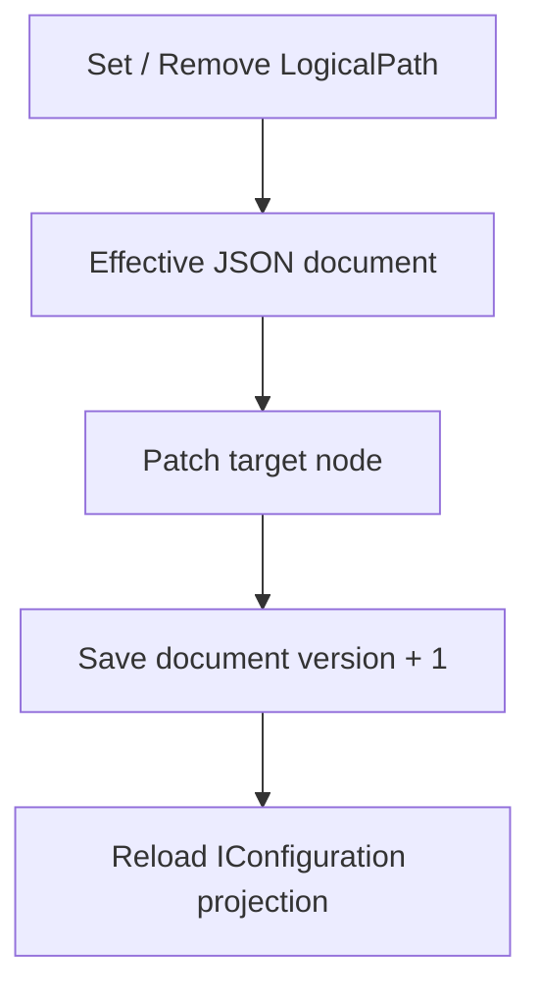

`ModuleConfigurationOption` 继承 Monica 的基础 module option，并增加 Configuration 自己的 schema、source inventory 和 distributed reload 选项。模块的主要配置方式仍然是在 Options 类型上使用 `[Configuration]` 和 `[OptionSetting]` 声明 schema，并在宿主注册时选择 file 或 DB store preset。

## Module options

| Property | Type | Default | Required | When to change | Notes |
|---|---|---|---|---|---|
| `DefaultSectionPathConvention` | `ConfigurationSectionPathConvention` | `ShortTypeName` | No | 未在 `[Configuration]` 上显式设置 section path，且宿主希望用命名空间限定根路径时改为 `ClrFullName`。 | 影响 schema scanning 和 Options binding 根路径。 |
| `DuplicateSectionPathBehavior` | `ConfigurationDuplicateSectionPathBehavior` | `FailFast` | No | 迁移旧系统时临时允许重复 section path。 | 推荐保持 `FailFast`，否则 source inspection 和 mutation 目标会变得不明确。 |
| `IncludeUnmanagedSourceInventoryItems` | `bool` | `true` | No | 当宿主不希望 Configuration UI 展示非 Monica 管理的 runtime key 时关闭。 | 只影响 source/storage 页面中的来源清单；不影响 Monica-managed definitions、source chain 或 Options 绑定。 |
| `InstanceId` | `string` | 随机 GUID N 格式 | No | 宿主已有稳定实例身份，并希望 distributed reload 通知能识别来源进程时设置。 | 用于忽略本进程产生的 reload notification。 |
| `RemoteReloadDebounceDelay` | `TimeSpan` | `500 ms` | No | 分布式通知过于密集，需要调整本地 reload 合并窗口时修改。 | 多个通知会在该窗口内合并。 |
| `RemoteReloadMaxJitterDelay` | `TimeSpan` | `2 s` | No | 多实例同时 reload 对存储或下游造成压力时调大。 | 为远程 reload 增加随机延迟，降低 herd effect。 |
| `RemoteReloadDedupeWindow` | `TimeSpan` | `5 min` | No | 通知通道重试窗口明显更长或更短时调整。 | 用于保留已处理 notification id，避免重复 reload。 |

## 配置定义

一个带 `[Configuration]` 的类会变成一个 `ConfigurationDefinition`。

| 字段 | 来源 | 说明 |
|---|---|---|
| `DefinitionKey` | `[Configuration].DefinitionKey`，未设置时使用 CLR 类型身份 | 稳定唯一身份。跨服务、文件/数据库存储、历史、UI、导入导出和 mutation 都使用它。 |
| `SectionPath` | 构造参数或 `[Configuration].SectionPath`，未设置时由 scanner 推导 | Microsoft `IConfiguration` 的绑定根路径，也是第一次 seed host config 的路径。 |
| `DisplayName` | `[Configuration].DisplayName`，未设置时使用类型名 | UI 展示名，可以重复。 |
| `ClrTypeName` | 扫描到的 Options 类型 | 诊断、导出和 schema 识别使用。 |
| `FromProject` | 发布配置定义的程序集 | 诊断和筛选使用，由 Monica 扫描器自动记录。 |
| `Category` | `[Configuration].Category` | UI 分组和业务自定义分类。 |
| `ReloadBehavior` | `[Configuration].ReloadBehavior` | 默认生效策略，节点可覆盖。 |
| `SchemaHash` | 由扫描器计算 | 用于识别 schema 漂移。 |

```csharp
[Configuration(
    "Demo:DocumentationPortal",
    DefinitionKey = "docs.portal.demo",
    DisplayName = "Docs Portal Demo",
    Category = "Documentation Demo",
    ReloadBehavior = ConfigurationReloadBehavior.OnlineReloadable)]
public sealed class DemoDocumentationPortalOptions
{
}
```

## 配置节点

配置类会被扫描成一棵 `ConfigurationNodeDefinition` 树。节点类型由 CLR 类型推导：

| CLR 形态 | Node kind | 说明 |
|---|---|---|
| 普通 object | `Object` | 继续扫描公开实例属性。 |
| `IDictionary<TKey, TValue>` | `Dictionary` | key 作为字典项身份，value 作为模板节点。 |
| `IEnumerable<T>` / array | `List` | item 作为模板节点。带稳定 key 的 list 支持按项修改。 |
| `string`、数值、`bool`、`enum`、`DateTime`、`TimeSpan`、`Uri` 等 | `Scalar` | 作为叶子值参与读取、修改和投影。 |

## OptionSetting

`[OptionSetting]` 只承载 Monica 的管理元数据，不替代 DataAnnotations。

| 属性 | 默认值 | 用途 |
|---|---|---|
| `NodeKey` | `null` | 给节点一个稳定身份，适合未来属性重命名。 |
| `DisplayName` | `null` | UI 展示名。 |
| `Description` | `null` | UI、文档和说明弹窗使用。 |
| `IsSensitive` | `false` | 敏感值在 UI、facade、source file view 和导出文件中按 display-safe 方式处理。 |
| `TextSemantic` | `PlainText` | 标记 scalar `string` 的文本语义。正则表达式配置应显式使用 `ConfigurationTextSemantic.RegexPattern`。 |
| `ReloadBehavior` | `Inherit` | 覆盖定义级生效策略。 |
| `IsListItemKey` | `false` | 标记列表项内唯一的稳定 key 属性。每个 item 类型最多一个。 |

## 正则文本语义

当一个配置值本身就是正则表达式，而不是普通中文说明、关键字或枚举值时，应在对应的 scalar `string` 属性上显式声明 `TextSemantic`：

```csharp
using Monica.Configuration.Annotations;
using Monica.Configuration.Models;

public sealed class RouteMatchOptions
{
    [OptionSetting(
        DisplayName = "中文航路点正则",
        TextSemantic = ConfigurationTextSemantic.RegexPattern)]
    public string ChineseWaypointPattern { get; set; } = @"[\u4E00-\u9FA5]+";
}
```

`RegexPattern` 的行为只适用于已标记的字符串节点：

- UI、facade、source file view、JSON 编辑、导入导出和 mutation 保存会把非 ASCII UTF-16 code unit 规范化为大写 `\uXXXX`，例如 `一-龥` 会显示和保存为 `\u4E00-\u9FA5`。
- 现有 ASCII 正则转义保持稳定，例如 `\d`、`\w`、`\s` 和已经存在的 `\u4E00` 不会被二次改写。
- 普通中文配置值仍按中文保存和展示，不会因为属性名包含 `Pattern`、`Regex` 或 `Rule` 自动变成正则语义。
- `TextSemantic = RegexPattern` 只能用于 scalar `string` 节点；object、list、dictionary、enum 或数值节点会在 schema 扫描阶段 fail fast。

`[RegularExpression(...)]` 仍然表示“用正则验证这个值”，它会生成 `RegexRule`。它不表示“这个配置值本身是正则”。如果一个字符串既要被正则校验，又要作为正则表达式供业务代码使用，需要同时保留 DataAnnotations 并设置 `TextSemantic`。

## 验证规则

配置验证直接复用 .NET DataAnnotations。扫描器会把常见验证注解转换成 `ConfigurationValidationRule`，供 UI 展示、JSON edit、import 和 mutation 校验使用；Options 绑定后仍会调用 `ValidateDataAnnotations()`。

| DataAnnotation | Monica rule |
|---|---|
| `[Required]` | `RequiredRule` |
| `[Range]` | `RangeRule` |
| `[RegularExpression]` | `RegexRule` |
| `[MaxLength]` | `MaxLengthRule` |
| `[MinLength]` | `MinLengthRule` |
| `[StringLength]` | `MaxLengthRule` |

UI 会对 `TimeSpan`、`DateTime`、数值、enum/allowed values、regex、range 和必填值做本地校验。无效值不会进入 saveable pending changes，而是作为 validation issue 暂存并阻止保存。

## LogicalPath

`LogicalPath` 是配置管理的稳定路径，不是简单字符串 DSL。它由结构化 segment 组成：

| Segment | 用途 | 示例 canonical |
|---|---|---|
| `PropertySegment` | 对象属性 | `Security.Authority` |
| `DictionaryKeySegment` | 字典 key | `Services[$billing]` |
| `ListItemKeySegment` | 带稳定 key 的 list item | `ConnectedDbs[#main]` |
| `ListIndexSegment` | 投影和诊断用 list index | `ConnectedDbs[@0]` |

`$` 表示 dictionary key，`#` 表示 list item key，`@` 表示 list index。它们是 Monica canonical path 的显示和存储约定；在代码内应优先使用 `LogicalPath` 和 segment 类型，而不是手写字符串。

## Effective value document

运行时修改围绕一份完整 JSON document 工作。每个 `DefinitionKey` 对应一个 Monica-managed current effective value：

- File mode：`effective/{DefinitionKey}.json`。
- DB mode：effective value table 中的一行 JSON document。

修改 scalar、object、dictionary item、keyed list item 或整个复杂节点时，Monica 会按 `LogicalPath` patch 这份 JSON document，然后提升 document version 并写入 history。



## Runtime source values

`ConfigurationEffectiveValue` 返回的是 display-safe 的当前运行时有效值。它会携带 `EffectiveSource`：

- 如果 Monica provider 是最高优先级来源，`Version` 来自 Monica effective document。
- 如果外部 JSON、环境变量或其他 provider 覆盖了该 key，`DisplayValue` 来自那个 provider，`Version` 可能为 `null`。
- 如果来源是可写 JSON provider，UI mutation 会写该 JSON 文件；如果来源只读，UI 会禁用编辑并说明原因。

## List 和 Dictionary

Dictionary 天然使用 key 作为身份。为了能稳定修改 list item，列表项类型应选择一个公开 scalar 属性并标记 `IsListItemKey = true`。

```csharp
public sealed class ConnectedDbOptions
{
    [Required]
    [OptionSetting("Name", IsListItemKey = true)]
    public string Name { get; set; } = "";

    [Required]
    [OptionSetting("Connection String", IsSensitive = true)]
    public string ConnectionString { get; set; } = "";
}
```

没有稳定 item key 的 list 仍然可以整体替换，但不适合按项做精确 mutation。`ListIndexSegment` 只用于 projection 和诊断，mutation 请求不能把它当成长期稳定身份。

## 敏感值

敏感值由 `[OptionSetting(IsSensitive = true)]` 声明。UI、facade、source file view 和导出文件会把当前值作为 display-safe 值处理，默认不展示明文。

`IsSensitive` 不是权限控制。它只描述配置节点的展示和编辑语义；谁能查看或修改配置仍应由宿主认证授权决定。

当前 v1 store 不提供字段级密文 payload 或外部 secret reference。将敏感值纳入 effective JSON document 或外部 JSON 文件时，应由所选存储、部署环境和访问控制保障静态数据安全，或将密钥保留在 Monica 管理范围之外。

## 生效策略

| Reload behavior | 含义 |
|---|---|
| `OnlineReloadable` | 可以通过配置 reload 被运行进程观察到。 |
| `RequiresRestart` | 修改允许保存，但需要重启进程才能安全生效。 |
| `StaticAfterStartup` | 启动后按静态配置处理，UI 会提示它不应被当作热更新配置。 |
| `Inherit` | 节点继承定义或父级策略。 |

`RequiresRestart` 和 `StaticAfterStartup` 都会提示用户重启，但语义不同：前者强调“修改后需要重启”，后者强调“这个值设计上只在启动阶段读取”。

## 导入导出文件格式

导出文件是 versioned JSON package，当前 `formatVersion` 为 `1`。核心字段包括：

| 字段 | 说明 |
|---|---|
| `exportedAt` / `exportedBy` | 导出时间和操作人。 |
| `systemVersion` / `environmentName` | 导出环境信息。 |
| `includeSensitive` | 是否包含敏感值。默认导出会脱敏。 |
| `definitions` | 每个 Monica-managed definition 的导出内容。 |
| `definitions[].definitionKey` | 稳定 definition 身份。 |
| `definitions[].schemaVersion` / `schemaHash` | 导入时用于提示 schema mismatch。 |
| `definitions[].sourceSummary` | 导出时当前有效值涉及的来源摘要。 |
| `definitions[].value` | root JSON value。 |
| `definitions[].redactedPaths` | 被脱敏的 logical path，导入时跳过。 |

导入是“报告并暂存”，不是直接写 store。未知 definition/path、schema mismatch、只读来源和验证错误会进入报告；有效变更进入 UI 暂存，最后仍通过保存 mutation group 提交。
