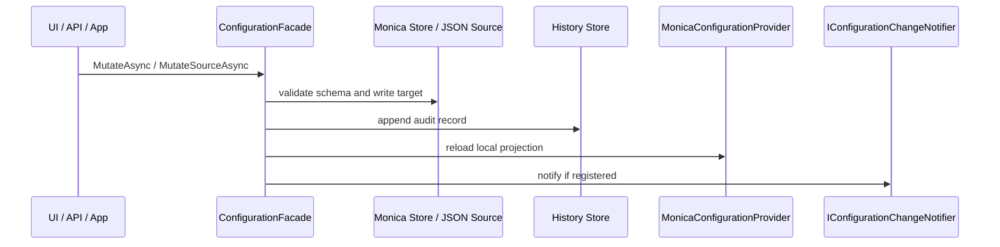

## 注册扩展

| Method | What it enables | Required | Typical use |
|---|---|---|---|
| `MonicaConfigurationInputPlan.Create(...)` | 创建不可变输入计划 | 是 | 一次冻结 store、section-path convention 和有序 managed JSON sources。 |
| `UseFileConfigurationStore(...)` | 在输入计划上选择文件存储 | 是，二选一 | 单体、开发、演示、本地运维。 |
| `UseDbConfigurationStore(...)` | 在输入计划上选择 EF Core 数据库存储 | 是，二选一 | 分布式部署，所有实例共享同一配置事实源。 |
| `AddManagedJsonFile(...)` | 在输入计划上追加 JSON source，并登记来源元数据 | 否 | 需要让文件优先覆盖 Monica store，或允许操作员通过 UI 修改某个 JSON 文件。 |
| `monica.AddConfiguration(inputPlan)` | 把同一输入计划投影到运行时 Configuration 模块 | 是 | 注册 schema、Options、runtime provider、mutation、history、rollback、source inspection 和 facade。 |

宿主必须先显式选择一种 store preset，再把同一份输入计划传给运行时模块：

```csharp
var configurationInputPlan = MonicaConfigurationInputPlan.Create(inputs => inputs
    .UseFileConfigurationStore());

builder.AddMonica(monica =>
{
    monica.AddConfiguration(configurationInputPlan);
});
```

或：

```csharp
var configurationInputPlan = MonicaConfigurationInputPlan.Create(inputs => inputs
    .UseDbConfigurationStore(options =>
        options.UseSqlServer(configurationStoreConnectionString)));

builder.AddMonica(monica =>
{
    monica.AddConfiguration(configurationInputPlan);
});
```

## Storage bundle

每个宿主只启用一个 active Monica store bundle，bundle 内包含三类存储职责：

| Store contract | 保存内容 | File mode | DB mode |
|---|---|---|---|
| `IConfigurationEffectiveValueReader` | 只读读取当前 effective document；startup snapshot 只持有该边界 | `effective/{IDENTITY}.json` | `ConfigurationEffectiveValues` |
| `IConfigurationEffectiveValueStore` | 在 reader 基础上创建或保存每个 `DefinitionKey` 的 effective JSON document | `effective/{IDENTITY}.json` + `effective/.metadata/{IDENTITY}.metadata.json` | `ConfigurationEffectiveValues` |
| `IConfigurationMetadataStore` | 发布后的配置定义、schema 和 store metadata | `metadata/definitions/{IDENTITY}.json` | `ConfigurationDefinitions` |
| `IConfigurationHistoryStore` | mutation group 和每条 mutation history | `history/history.jsonl`、`history/groups.json` | `ConfigurationValueHistories`、`ConfigurationMutationGroups` |

`IConfigurationChangeNotifier` 只是 v1 的抽象扩展点。当前核心模块没有内置跨服务热重载实现。

## File store

文件存储适合单体和本地模式：

```csharp
var configurationInputPlan = MonicaConfigurationInputPlan.Create(inputs => inputs
    .UseFileConfigurationStore(options =>
    {
        options.RootDirectory = Path.Combine(
            builder.Environment.ContentRootPath,
            "configuration-store");
    }));

builder.AddMonica(monica =>
{
    monica.AddConfiguration(configurationInputPlan);
});
```

默认根目录是应用基目录下的 `monica-configuration`。`{IDENTITY}` 是对 invariant-uppercase `DefinitionKey` 的 UTF-8 bytes 计算 SHA-256 后得到的 64 位大写十六进制字符串，因此大小写变体会落到同一组文件，原始 key 中的路径分隔符或其他非法文件名字符也不会进入路径。原始 key 保留在 definition metadata 与 effective metadata sidecar 中并与文件名 identity 互相校验；冲突或损坏会明确失败。effective JSON 仍然是独立、可人工查看和编辑的文件。

旧版本按 `DefinitionKey` 命名的 definition、effective 或 sidecar 文件会在首次 store access 时被拒绝。升级前必须使用了解 provider metadata 的迁移流程，或备份后重建 store；Monica 不会自动重命名、删除或迁移旧布局。

## DB store

数据库存储适合分布式模式。所有实例共享同一个 DB 事实源：

```csharp
var configurationInputPlan = MonicaConfigurationInputPlan.Create(inputs => inputs
    .UseDbConfigurationStore(options =>
        options.UseSqlServer(configurationStoreConnectionString)));

builder.AddMonica(monica =>
{
    monica.AddConfiguration(configurationInputPlan);
});
```

`UseDbConfigurationStore(...)` 来自 `Monica.Configuration.EfCore`，它会注册 `ConfigurationDbContext` 并把 effective values、metadata 和 history 三个 store contract 都替换为 `DatabaseConfigurationStore`。

DB mode 的 bootstrap 配置只能依赖宿主原生 `IConfiguration`。例如连接串必须来自 `appsettings`、环境变量、User Secrets 或部署系统，不能依赖 Monica-managed configuration。如果启动时无法加载 DB-managed configuration，服务应 fail fast。

## 自定义 store composition

自定义 `IMonicaConfigurationStoreComposition` 同时拥有两个清晰边界：`ConfigureRuntime(...)` 只记录 runtime registration，`CreateStartupReader()` 返回独立拥有、可由 snapshot loader 释放的只读 reader。不要让 startup reader 暴露 `EnsureCreatedAsync(...)` 或 `SaveAsync(...)`。

`IConfigurationEffectiveValueReader` 提供 `Descriptor`、`GetAsync(...)` 和 `GetManyAsync(...)`。Batch read 必须为每个请求 key 返回一项，并保持请求顺序；snapshot loader 会调用一次 `GetManyAsync(...)` 并验证数量与非空 document 的 definition key。`IConfigurationEffectiveValueStore` 继承 reader，再增加创建和保存能力。reader contract 不提供跨进程 atomicity，也不保证稍后的读取仍观察到同一状态。

EF Core input-plan callback 可能在 startup 和 runtime context 中分别执行，因此必须 deterministic、side-effect-free，并使用在两个阶段都保持稳定的捕获值。数据库 migration 必须在 startup snapshot 前由宿主完成；Configuration input plan 不负责建表或升级 schema。

## 组合期配置边界

组合 Monica 模块图时，宿主还没有构建完成。连接配置 store、完成 migration，以及建立 startup snapshot 本身所需的启动参数必须直接来自 `builder.Configuration`：

```csharp
var configurationStoreConnectionString =
    builder.Configuration.GetConnectionString("Configuration")
    ?? throw new InvalidOperationException("Missing Configuration connection string.");
var configurationInputPlan = MonicaConfigurationInputPlan.Create(inputs => inputs
    .UseDbConfigurationStore(options =>
        options.UseSqlServer(configurationStoreConnectionString)));

builder.AddMonica(monica =>
{
    monica.AddConfiguration(configurationInputPlan);
});
```

应用构建完成后，业务代码通过 `IOptions<T>`、`IOptionsSnapshot<T>` 或 `IOptionsMonitor<T>` 消费 Monica 管理的配置。不要为了在组合阶段读取托管配置而提前构建临时 DI 容器；这会产生第二套服务和 Options 生命周期。

## Point-in-time 启动快照

只有当某个 Monica-managed Option 必须在运行时 provider 激活前驱动宿主拓扑时，才从同一输入计划加载启动快照：

```csharp
using var bootstrap = configurationInputPlan.BuildBootstrapConfiguration(builder);

var startupOptions = await configurationInputPlan.LoadEffectiveOptionsSnapshotAsync(
    bootstrap,
    [typeof(TopologyOptions)]);

var topology = startupOptions.Get<TopologyOptions>();
```

该操作对请求类型去重后只执行一次有序 batch read，并校验返回数量、顺序对应的 definition key 和 JSON 投影。优先级固定为：host configuration → store 中已存在的 Monica document 或缺失时的内存 seed → 按声明顺序追加的 managed JSON。只有 document 确实不存在时才回退到 seed；reader failure、取消、malformed JSON、projection 或 binding failure 都会让启动失败。

启动快照不发布 definition metadata，不创建文件或数据库行，也不承诺与稍后的 runtime configuration 相同。“只读”描述的是 store interaction；`Get<TOptions>()` 返回普通 Options object，启动代码应把它当作已捕获输入而不是可写 store view。后续 store edit、purge 或 runtime activation 生成的 seed 都可能改变运行时结果；真正的 metadata publication 和缺失 document 持久化由 runtime activation 完成。驱动拓扑的字段应声明 `StaticAfterStartup` 或 `RequiresRestart`，但这两个标记不会建立跨阶段 consistency barrier。

`BuildBootstrapConfiguration(...)` 返回的 root 和 startup reader 都是短生命周期资源。bootstrap 与 snapshot 内部的 managed JSON provider 始终使用 `reloadOnChange: false`；输入计划声明的值只由长生命周期 runtime provider 保留。

## Managed JSON source

`AddManagedJsonFile(...)` 适合“少量启动/现场参数必须继续由文件控制”的场景，例如客户现场交付文件、数据库连接串覆盖文件或临时运维开关。

```csharp
var configurationInputPlan = MonicaConfigurationInputPlan.Create(inputs => inputs
    .UseDbConfigurationStore(options => options.UseSqlite(configurationStoreConnectionString))
    .AddManagedJsonFile(
        "docs-external-settings.json",
        optional: false,
        reloadOnChange: true,
        options =>
        {
            options.DisplayName = "Docs External Demo Settings";
            options.Description = "Operator-managed JSON file registered through Monica.Configuration.";
            options.IsWritable = true;
        }));

builder.AddMonica(monica =>
{
    monica.AddConfiguration(configurationInputPlan);
});
```

该方法做两件事：

1. 记录运行时需要的 `AddJsonFile(path, optional, reloadOnChange)` 声明；bootstrap 与 startup snapshot 强制关闭 watcher。
2. 记录 Monica UI 元数据：display name、description、path、optional、reloadOnChange、writable。

它默认追加在 Monica effective provider 之后，因此优先级高于 Monica store。后续宿主如果继续添加 provider，仍然遵守 Microsoft Configuration 的“后添加 wins”规则。

## Runtime source inspection

`ConfigurationFacade` 可以检查 `IConfigurationRoot.Providers`：

| Capability | Facade method | 说明 |
|---|---|---|
| 列出所有 provider | `GetConfigurationSourcesAsync()` | 包含 priority index、provider type、source kind、是否 writable、是否 Monica-managed、JSON file path 等。 |
| 查看来源清单 | `GetConfigurationSourceInventoriesAsync()` | 按 source 展示它提供了多少 key，其中多少是当前生效值。 |
| 查看 definition 来源贡献 | `GetDefinitionSourceContributionsAsync(...)` | 按配置定义统计每个 source 提供和生效的 scalar 数量。 |
| 查看单项来源链路 | `GetSourceChainAsync(...)` | 按优先级从高到低展示该配置项所有提供值的 source，并标出当前生效来源。 |
| 查看 JSON 文件 | `GetSourceFileViewAsync(...)` | 返回格式化 JSON，已知敏感路径默认脱敏。 |

只有 `MonicaEffectiveStore` 和可解析 physical path 的 `JsonFile` source 可写。环境变量、命令行、memory 和未知/custom provider 可见但只读。

## Source-targeted mutation

常规 mutation 写 Monica effective store：

```csharp
await facade.MutateAsync(new ConfigurationMutationRequest
{
    DefinitionKey = "demo.app",
    LogicalPath = LogicalPath.FromProperties("AppName"),
    MutationKind = ConfigurationMutationKind.Set,
    Value = ConfigurationStoredValue.FromJson("\"New Name\""),
    ExpectedSchemaVersion = 1
});
```

当 UI 选择修改一个可写 JSON source 时，会走 `MutateSourceAsync(...)`。它会 patch 物理 JSON 文件，而不是调用 `JsonConfigurationProvider.Set(...)` 作为持久化机制。写入前会检查 source revision，写入后会重载本地配置并记录 history。

历史记录会说明目标：

| 字段 | Monica store mutation | External JSON mutation |
|---|---|---|
| `TargetKind` | `MonicaEffectiveStore` | `ExternalConfigurationSource` |
| `SourceProviderType` | 空 | JSON provider type |
| `SourceDisplayName` | 空 | 来源显示名 |
| `SourcePhysicalPath` | 空 | JSON 文件物理路径 |
| `SourceConfigurationPath` | 空 | 被写入的 Microsoft configuration path |
| `SourceRevisionBefore/After` | 空 | JSON 文件内容 hash |

## Bootstrap 配置边界

`appsettings*.json`、环境变量、User Secrets 等仍然属于 Microsoft 原生 `IConfiguration`。它们用于：

- 启动期 bootstrap，例如 DB 连接串、服务发现、日志初始化。
- startup snapshot 中 document 缺失时作为内存 seed 输入。
- runtime activation 第一次创建 Monica effective value document 时作为持久化 seed 输入。
- 作为 runtime provider 参与 source chain，必要时覆盖 Monica store。

它们不属于 Monica-managed definitions 的存储层。Monica 不会自动把 `appsettings.json` 的全部内容纳入 effective store；只有 `[Configuration]` 定义出的配置项会成为 Monica-managed definitions。

## Options 绑定中的集合默认值

Monica 注册 `[Configuration]` 类型时，会为运行时 `IOptions<T>` / `IOptionsSnapshot<T>` / `IOptionsMonitor<T>` 使用 Monica 自己的绑定语义。它仍然委托 Microsoft Configuration Binder 完成类型转换，但在绑定前会先处理集合默认值：

- 如果某个 `List<T>`、array、mutable collection 或 dictionary 的配置 section 存在且有子项，配置值会**替换** CLR 默认集合。
- 如果该 section 不存在，CLR 默认集合会被保留。
- 嵌套对象会按配置 section 递归处理。
- `ConfigurationKeyNameAttribute` 指定的属性名同样适用。

这样可以避免官方 Binder 在集合属性已有默认值时把配置项 append 到默认集合后面。例如 `public List<string> Providers { get; set; } = ["local"];` 遇到配置 `Providers:0 = "db"` 时，最终运行时 options 中的值是 `["db"]`，而不是 `["local", "db"]`。

该集合替换语义属于运行时 Options 绑定。启动参数仍遵守宿主原生 `IConfiguration` 的绑定与 provider 优先级。

## Mutation flow

运行时修改通过 `ConfigurationFacade` 发起：



复杂对象、dictionary、keyed list 或 scalar leaf 最终都会记录为清晰的 history。复杂节点编辑、JSON edit 和 import 会优先压缩为 container mutation，避免历史被大量 scalar 行淹没。

## ConfigurationFacade

`ConfigurationFacade` 是 UI 和应用层的主要入口。常用方法：

| Method | 用途 |
|---|---|
| `GetDefinitionsAsync()` / `GetDefinitionAsync(...)` | 获取配置定义列表和 schema detail。 |
| `GetEffectiveValueAsync(...)` | 获取 display-safe runtime effective value 和 effective source。 |
| `GetStorageOverviewAsync()` / `GetStoreStatesAsync()` | 查看当前 store bundle 和运行状态。 |
| `GetConfigurationSourcesAsync()` / `GetConfigurationSourceInventoriesAsync()` | 查看 runtime provider 和 source inventory。 |
| `GetDefinitionSourceContributionsAsync(...)` / `GetSourceChainAsync(...)` | 查看 definition 或单项配置来源链路。 |
| `GetSourceFileViewAsync(...)` | 查看 display-safe JSON source 文件内容。 |
| `MutateAsync(...)` | 写入 Monica effective store。 |
| `MutateSourceAsync(...)` | 写入可写外部 JSON source。 |
| `ApplyMutationGroupAsync(...)` | 在一个受审计的变更组中校验并应用多项配置修改。 |
| `GetHistoryAsync(...)` / `QueryHistoryAsync(...)` | 查询配置历史。 |
| `RollbackHistoryAsync(...)` / `RollbackHistoriesAsync(...)` / `RollbackGroupAsync(...)` | 回滚单条历史、多条历史或整组变更。 |
| `GetDebugViewAsync()` | 查看当前 Microsoft configuration debug view。 |

Facade 返回 `Res<T>` 或 `Res`，调用方应按项目统一的 `Res` 失败处理方式检查结果。不要在 UI 或 API 层直接调用内部 service。

## Module dependencies

| Module | Dependency |
|---|---|
| `Monica.Configuration.UI` | `Monica.Configuration`、`Monica.UI`、Localization、Shell UI、Diff Highlight UI |
| `Monica.Configuration.EfCore` | `Monica.Configuration`、`Monica.Repository`、EF Core |
