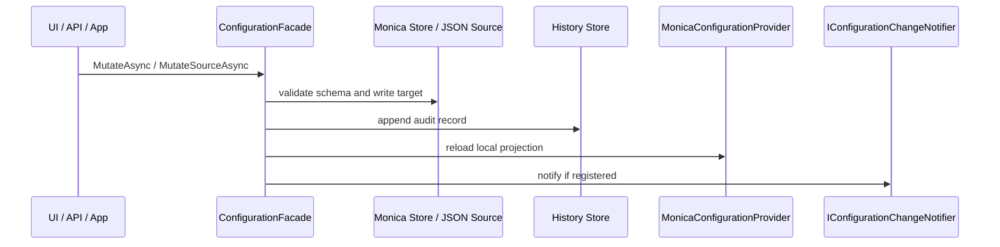

## 注册扩展

| Method | What it enables | Required | Typical use |
|---|---|---|---|
| `monica.AddConfiguration()` | 注册核心配置模块、schema 扫描、Options 绑定、mutation、history、rollback、source inspection 和 facade | 是 | 声明 Monica 管理的配置定义时。 |
| `UseFileConfigurationStore(...)` | 使用文件存储 effective values、metadata 和 history | 是，二选一 | 单体、开发、演示、本地运维。 |
| `UseDbConfigurationStore(...)` | 使用 EF Core 数据库存储 effective values、metadata 和 history | 是，二选一 | 分布式部署，所有实例共享同一配置事实源。 |
| `AddManagedJsonFile(...)` | 追加一个 JSON configuration source，并把来源元数据登记给 Monica UI | 否 | 需要让文件优先覆盖 Monica store，或允许操作员通过 UI 修改某个 JSON 文件。 |

`monica.AddConfiguration()` 不会隐式选择文件或数据库存储。宿主必须显式选择一种 store preset：

```csharp
builder.AddMonica(monica =>
{
    monica.AddConfiguration()
        .UseFileConfigurationStore();
});
```

或：

```csharp
builder.AddMonica(monica =>
{
    monica.AddConfiguration()
        .UseDbConfigurationStore((serviceProvider, options) =>
        {
            options.UseSqlServer(builder.Configuration.GetConnectionString("Configuration"));
        });
});
```

## Storage bundle

每个宿主只启用一个 active Monica store bundle，bundle 内包含三类存储职责：

| Store contract | 保存内容 | File mode | DB mode |
|---|---|---|---|
| `IConfigurationEffectiveValueStore` | 每个 `DefinitionKey` 的 Monica-managed effective JSON document | `effective/{DefinitionKey}.json` | `ConfigurationEffectiveValues` |
| `IConfigurationMetadataStore` | 发布后的配置定义、schema 和 store metadata | `metadata/definitions/{DefinitionKey}.json` | `ConfigurationDefinitions` |
| `IConfigurationHistoryStore` | mutation group 和每条 mutation history | `history/history.jsonl`、`history/groups.json` | `ConfigurationValueHistories`、`ConfigurationMutationGroups` |

`IConfigurationChangeNotifier` 只是 v1 的抽象扩展点。当前核心模块没有内置跨服务热重载实现。

## File store

文件存储适合单体和本地模式：

```csharp
builder.AddMonica(monica =>
{
    monica.AddConfiguration()
        .UseFileConfigurationStore(options =>
        {
            options.RootDirectory = Path.Combine(builder.Environment.ContentRootPath, "configuration-store");
        });
});
```

默认根目录是应用基目录下的 `monica-configuration`。每个配置定义使用 `DefinitionKey` 作为稳定文件名，因此 file mode 会拒绝包含非法文件名字符或路径分隔符的 key。

## DB store

数据库存储适合分布式模式。所有实例共享同一个 DB 事实源：

```csharp
builder.AddMonica(monica =>
{
    monica.AddConfiguration()
        .UseDbConfigurationStore((serviceProvider, options) =>
        {
            options.UseSqlServer(builder.Configuration.GetConnectionString("Configuration"));
        });
});
```

`UseDbConfigurationStore(...)` 来自 `Monica.Configuration.EfCore`，它会注册 `ConfigurationDbContext` 并把 effective values、metadata 和 history 三个 store contract 都替换为 `DatabaseConfigurationStore`。

DB mode 的 bootstrap 配置只能依赖宿主原生 `IConfiguration`。例如连接串必须来自 `appsettings`、环境变量、User Secrets 或部署系统，不能依赖 Monica-managed configuration。如果启动时无法加载 DB-managed configuration，服务应 fail fast。

## 组合期配置边界

组合 Monica 模块图时，宿主还没有构建完成。连接配置 store、日志初始化和外部基础设施注册所需的启动参数必须直接来自 `builder.Configuration`：

```csharp
var configurationStoreConnectionString =
    builder.Configuration.GetConnectionString("Configuration")
    ?? throw new InvalidOperationException("Missing Configuration connection string.");

builder.AddMonica(monica =>
{
    monica.AddConfiguration()
        .UseDbConfigurationStore((_, options) =>
        {
            options.UseSqlServer(configurationStoreConnectionString);
        });
});
```

应用构建完成后，业务代码通过 `IOptions<T>`、`IOptionsSnapshot<T>` 或 `IOptionsMonitor<T>` 消费 Monica 管理的配置。不要为了在组合阶段读取托管配置而提前构建临时 DI 容器；这会产生第二套服务和 Options 生命周期。

## Managed JSON source

`AddManagedJsonFile(...)` 适合“少量启动/现场参数必须继续由文件控制”的场景，例如客户现场交付文件、数据库连接串覆盖文件或临时运维开关。

```csharp
builder.AddMonica(monica =>
{
    monica.AddConfiguration()
        .UseDbConfigurationStore((_, options) => options.UseSqlite(configurationStoreConnectionString))
        .AddManagedJsonFile(
            "docs-external-settings.json",
            optional: false,
            reloadOnChange: true,
            options =>
            {
                options.DisplayName = "Docs External Demo Settings";
                options.Description = "Operator-managed JSON file registered through Monica.Configuration.";
                options.IsWritable = true;
            });
});
```

该方法做两件事：

1. 调用 Microsoft `AddJsonFile(path, optional, reloadOnChange)`。
2. 记录 Monica UI 元数据：display name、description、path、optional、reloadOnChange、writable。

它默认追加在 Monica effective provider 之后，因此优先级高于 Monica store。后续宿主如果继续添加 provider，仍然遵守 Microsoft Configuration 的“后添加 wins”规则。

## Runtime source inspection

`ConfigurationFacade` 可以检查 `IConfigurationRoot.Providers`：

| Capability | Facade method | 说明 |
|---|---|---|
| 列出所有 provider | `GetConfigurationSourcesAsync()` | 包含 priority index、provider type、source kind、是否 writable、是否 Monica-managed、JSON file path 等。 |
| 查看来源清单 | `GetConfigurationSourceInventoriesAsync()` | 按 source 展示它提供了多少 key，其中多少是当前生效值。 |
| 查看 definition 来源贡献 | `GetDefinitionSourceContributionsAsync(...)` | 按配置定义统计每个 source 提供和生效的 scalar 数量。 |
| 查看单项来源链路 | `GetSourceChainAsync(...)` | 按优先级从高到低展示该配置项所有提供值的 source，并标出当前生效来源。 |
| 查看 JSON 文件 | `GetSourceFileViewAsync(...)` | 返回格式化 JSON，已知敏感路径默认脱敏。 |

只有 `MonicaEffectiveStore` 和可解析 physical path 的 `JsonFile` source 可写。环境变量、命令行、memory 和未知/custom provider 可见但只读。

## Source-targeted mutation

常规 mutation 写 Monica effective store：

```csharp
await facade.MutateAsync(new ConfigurationMutationRequest
{
    DefinitionKey = "demo.app",
    LogicalPath = LogicalPath.FromProperties("AppName"),
    MutationKind = ConfigurationMutationKind.Set,
    Value = ConfigurationStoredValue.FromJson("\"New Name\""),
    ExpectedSchemaVersion = 1
});
```

当 UI 选择修改一个可写 JSON source 时，会走 `MutateSourceAsync(...)`。它会 patch 物理 JSON 文件，而不是调用 `JsonConfigurationProvider.Set(...)` 作为持久化机制。写入前会检查 source revision，写入后会重载本地配置并记录 history。

历史记录会说明目标：

| 字段 | Monica store mutation | External JSON mutation |
|---|---|---|
| `TargetKind` | `MonicaEffectiveStore` | `ExternalConfigurationSource` |
| `SourceProviderType` | 空 | JSON provider type |
| `SourceDisplayName` | 空 | 来源显示名 |
| `SourcePhysicalPath` | 空 | JSON 文件物理路径 |
| `SourceConfigurationPath` | 空 | 被写入的 Microsoft configuration path |
| `SourceRevisionBefore/After` | 空 | JSON 文件内容 hash |

## Bootstrap 配置边界

`appsettings*.json`、环境变量、User Secrets 等仍然属于 Microsoft 原生 `IConfiguration`。它们用于：

- 启动期 bootstrap，例如 DB 连接串、服务发现、日志初始化。
- 第一次创建 Monica effective value document 时作为 seed 输入。
- 作为 runtime provider 参与 source chain，必要时覆盖 Monica store。

它们不属于 Monica-managed definitions 的存储层。Monica 不会自动把 `appsettings.json` 的全部内容纳入 effective store；只有 `[Configuration]` 定义出的配置项会成为 Monica-managed definitions。

## Options 绑定中的集合默认值

Monica 注册 `[Configuration]` 类型时，会为运行时 `IOptions<T>` / `IOptionsSnapshot<T>` / `IOptionsMonitor<T>` 使用 Monica 自己的绑定语义。它仍然委托 Microsoft Configuration Binder 完成类型转换，但在绑定前会先处理集合默认值：

- 如果某个 `List<T>`、array、mutable collection 或 dictionary 的配置 section 存在且有子项，配置值会**替换** CLR 默认集合。
- 如果该 section 不存在，CLR 默认集合会被保留。
- 嵌套对象会按配置 section 递归处理。
- `ConfigurationKeyNameAttribute` 指定的属性名同样适用。

这样可以避免官方 Binder 在集合属性已有默认值时把配置项 append 到默认集合后面。例如 `public List<string> Providers { get; set; } = ["local"];` 遇到配置 `Providers:0 = "db"` 时，最终运行时 options 中的值是 `["db"]`，而不是 `["local", "db"]`。

该集合替换语义属于运行时 Options 绑定。启动参数仍遵守宿主原生 `IConfiguration` 的绑定与 provider 优先级。

## Mutation flow

运行时修改通过 `ConfigurationFacade` 发起：



复杂对象、dictionary、keyed list 或 scalar leaf 最终都会记录为清晰的 history。复杂节点编辑、JSON edit 和 import 会优先压缩为 container mutation，避免历史被大量 scalar 行淹没。

## ConfigurationFacade

`ConfigurationFacade` 是 UI 和应用层的主要入口。常用方法：

| Method | 用途 |
|---|---|
| `GetDefinitionsAsync()` / `GetDefinitionAsync(...)` | 获取配置定义列表和 schema detail。 |
| `GetEffectiveValueAsync(...)` | 获取 display-safe runtime effective value 和 effective source。 |
| `GetStorageOverviewAsync()` / `GetStoreStatesAsync()` | 查看当前 store bundle 和运行状态。 |
| `GetConfigurationSourcesAsync()` / `GetConfigurationSourceInventoriesAsync()` | 查看 runtime provider 和 source inventory。 |
| `GetDefinitionSourceContributionsAsync(...)` / `GetSourceChainAsync(...)` | 查看 definition 或单项配置来源链路。 |
| `GetSourceFileViewAsync(...)` | 查看 display-safe JSON source 文件内容。 |
| `MutateAsync(...)` | 写入 Monica effective store。 |
| `MutateSourceAsync(...)` | 写入可写外部 JSON source。 |
| `ApplyMutationGroupAsync(...)` | 在一个受审计的变更组中校验并应用多项配置修改。 |
| `GetHistoryAsync(...)` / `QueryHistoryAsync(...)` | 查询配置历史。 |
| `RollbackHistoryAsync(...)` / `RollbackHistoriesAsync(...)` / `RollbackGroupAsync(...)` | 回滚单条历史、多条历史或整组变更。 |
| `GetDebugViewAsync()` | 查看当前 Microsoft configuration debug view。 |

Facade 返回 `Res<T>` 或 `Res`，调用方应按项目统一的 `Res` 失败处理方式检查结果。不要在 UI 或 API 层直接调用内部 service。

## Module dependencies

| Module | Dependency |
|---|---|
| `Monica.Configuration.UI` | `Monica.Configuration`、`Monica.UI`、Localization、Shell UI、Diff Highlight UI |
| `Monica.Configuration.EfCore` | `Monica.Configuration`、`Monica.Repository`、EF Core |
