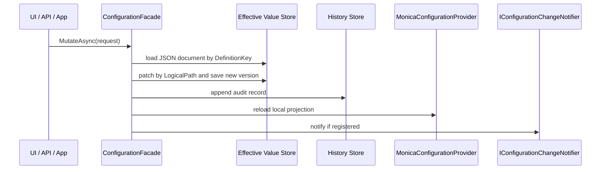

# Guide and Stores

## Guide methods

| Method | What it enables | Required | Typical use |
|---|---|---|---|
| `Mo.AddConfiguration()` | 注册核心配置模块、schema 扫描、Options 绑定、mutation、history、rollback 和 facade | 是 | 声明 Monica 管理的配置定义时。 |
| `UseFileConfigurationStore(...)` | 使用文件存储 effective values、metadata 和 history | 是，二选一 | 单体、开发、演示、本地运维。 |
| `UseDbConfigurationStore(...)` | 使用 EF Core 数据库存储 effective values、metadata 和 history | 是，二选一 | 分布式部署，所有实例共享同一配置事实源。 |

`Mo.AddConfiguration()` 不会隐式创建文件或数据库表。宿主必须显式选择一种存储预设：

```csharp
Mo.AddConfiguration()
    .UseFileConfigurationStore();
```

或：

```csharp
Mo.AddConfiguration()
    .UseDbConfigurationStore((serviceProvider, options) =>
    {
        options.UseSqlServer(builder.Configuration.GetConnectionString("Configuration"));
    });
```

## Storage bundle

当前设计不再暴露多 source priority。每个宿主只启用一个 active store bundle，bundle 内包含三类存储职责：

| Store contract | 保存内容 | File mode | DB mode |
|---|---|---|---|
| `IConfigurationEffectiveValueStore` | 每个 `DefinitionKey` 的最终 effective JSON document | `effective/{DefinitionKey}.json` | 每个 definition 一行 JSON document |
| `IConfigurationMetadataStore` | 发布后的配置定义、schema 和 store metadata | `metadata/definitions/{DefinitionKey}.json` | metadata table |
| `IConfigurationHistoryStore` | mutation group 和每条 mutation history | `history/*.json` / `history.jsonl` | history tables |

`IConfigurationChangeNotifier` 只是 v1 的抽象扩展点。当前核心模块没有内置跨服务热重载实现。

## Bootstrap 配置边界

`appsettings*.json`、环境变量、User Secrets 等仍然属于 Microsoft 原生 `IConfiguration`。它们只用于：

- 启动期 bootstrap，例如数据库连接串、服务发现、日志初始化。
- 第一次创建 effective value document 时作为 seed 输入。

它们不再作为 Monica runtime-managed source 出现在 UI 中，也没有 `json:default`、`environment:default` 这类优先级来源。初始化完成后，运行时修改只写入所选 store bundle。

## File store

文件存储适合单体和本地模式：

```csharp
Mo.AddConfiguration()
    .UseFileConfigurationStore(options =>
    {
        options.RootDirectory = Path.Combine(builder.Environment.ContentRootPath, "configuration-store");
    });
```

默认根目录是应用基目录下的 `monica-configuration`。每个配置定义使用 `DefinitionKey` 作为稳定文件名，因此 file mode 会拒绝不能作为文件名的 key。

## DB store

数据库存储适合分布式模式。所有实例共享同一个数据库事实源：

```csharp
Mo.AddConfiguration()
    .UseDbConfigurationStore((serviceProvider, options) =>
    {
        options.UseSqlServer(builder.Configuration.GetConnectionString("Configuration"));
    });
```

DB mode 的 bootstrap 配置只能依赖宿主原生 `IConfiguration`。例如连接串必须来自 `appsettings`、环境变量、User Secrets 或部署系统，不能依赖 Monica-managed configuration。如果启动时无法加载 DB-managed configuration，服务应 fail fast。

## Mutation flow

运行时修改通过 `ConfigurationFacade.MutateAsync(...)` 发起：



修改复杂对象、dictionary、keyed list 或 scalar leaf 时，存储层仍然保存整份 effective JSON document。Monica 会按 `LogicalPath` patch 文档中的目标节点，并记录 old/new value、version、user、group 和 timestamp。

## ConfigurationFacade

`ConfigurationFacade` 是 UI 和应用层的主要入口。常用方法：

| Method | 用途 |
|---|---|
| `GetDefinitionsAsync()` / `GetDefinitionAsync(...)` | 获取配置定义列表和 schema detail。 |
| `GetEffectiveValueAsync(...)` | 获取 display-safe effective value。 |
| `GetStorageOverviewAsync()` / `GetStoreStatesAsync()` | 查看当前 store bundle 和运行状态。 |
| `MutateAsync(...)` | 写入配置修改。 |
| `BeginMutationGroupAsync(...)` / `CompleteMutationGroupAsync(...)` | 创建并完成审计组。 |
| `GetHistoryAsync(...)` / `QueryHistoryAsync(...)` | 查询配置历史。 |
| `RollbackHistoryAsync(...)` / `RollbackGroupAsync(...)` | 回滚单条历史或整组变更。 |
| `GetDebugViewAsync()` | 查看当前 Microsoft configuration debug view。 |

Facade 返回 `Res<T>` 或 `Res`，调用方应按项目统一的 `Res` 失败处理方式检查结果。不要在 UI 或 API 层直接调用内部 service。

## Module dependencies

| Module | Dependency |
|---|---|
| `Monica.Configuration.UI` | `Monica.Configuration`、`Monica.UI`、Localization、Shell UI |
| `Monica.Configuration.EfCore` | `Monica.Configuration`、`Monica.Repository`、EF Core |
