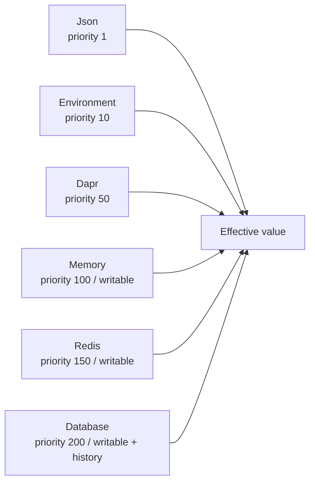

# Guide and Providers

## Guide methods

| Method | What it enables | Required | Typical use |
|---|---|---|---|
| `Mo.AddConfiguration()` | 注册核心配置模块 | 是 | 使用 Monica 管理配置定义和值来源时。 |
| `AddValueSource<TSource>()` | 注册自定义 `IConfigurationValueSource` | 否 | 你要接入自定义存储或外部配置系统时。 |
| `UseEfCoreConfigurationStore(...)` | 注册 EF Core 配置持久化 | 否 | 需要数据库保存 definition、override、history 和 mutation group 时。 |
| `UseRedisConfigurationSource()` | 注册 Redis 配置值来源 | 否 | 需要 Redis 作为高优先级可写 override store 时。 |
| `UseRedisChangeNotifications()` | 注册 Redis 变更通知 | 否 | 分布式实例之间用 Redis pub/sub fan-out reload 通知时。 |
| `UseDaprConfigurationSource()` | 注册 Dapr Configuration 只读来源 | 否 | 已有 Dapr configuration store，需要读取到 Monica schema 中时。 |
| `UseDaprChangeNotifications()` | 注册 Dapr pub/sub 变更通知 | 否 | 使用 Dapr pub/sub 广播配置变更通知时。 |

## Provider choices

| Source | Source key | Priority | Writable | History | How to enable |
|---|---:|---:|---|---|---|
| Json | `json:default` | `1` | 否 | 否 | `Mo.AddConfiguration()` 默认注册。 |
| Environment | `environment:default` | `10` | 否 | 否 | `Mo.AddConfiguration()` 默认注册。 |
| Dapr Configuration | `dapr:default` | `50` | 否 | 否 | `UseDaprConfigurationSource()` |
| Memory | `memory:default` | `100` | 是 | 否 | `Mo.AddConfiguration()` 默认注册。 |
| Redis | `redis:default` | `150` | 是 | 否 | `UseRedisConfigurationSource()` |
| Database | `db:default` | `200` | 是 | 是 | `UseEfCoreConfigurationStore(...)` |

优先级越高越先参与生效值选择。未指定 `TargetSourceKey` 的 mutation 会写入优先级最高的 writable source。

这些 source 是 Monica 配置领域层的来源，不等同于 Microsoft 原生 `IConfigurationProvider` 列表。核心模块另外提供 `MonicaConfigurationProvider` 作为投影层；是否把投影加入宿主 `IConfiguration` provider 链，由宿主集成代码决定。



## EF Core provider

`Monica.Configuration.EfCore` 是当前最完整的持久化 provider。它提供：

- `DatabaseConfigurationValueSource`：可写 override store。
- `IConfigurationHistorySource`：配置历史查询。
- `IConfigurationMutationGroupSource`：变更组持久化。
- `IConfigurationDefinitionPublisher`：启动时把本服务扫描到的 schema 发布到数据库。

```csharp
Mo.AddConfiguration()
    .UseEfCoreConfigurationStore((serviceProvider, options) =>
    {
        options.UseSqlServer(builder.Configuration.GetConnectionString("Configuration"));
    });
```

EF Core provider 有必需配置：必须通过 `UseDbContext(...)` 提供 `ConfigurationDbContext` 的配置。`UseEfCoreConfigurationStore(...)` 会完成这个要求。

## Redis provider

`Monica.Configuration.Redis` 提供 Redis-backed writable value source 和 Redis pub/sub 通知。它适合需要高优先级集中 override，但不需要数据库审计历史的场景。

```csharp
Mo.AddConfiguration()
    .UseRedisConfigurationSource()
    .UseRedisChangeNotifications();

new ModuleConfigurationRedisGuide().Register(options =>
{
    options.UseNormalConnection("localhost", 6379);
});
```

如果启用 Redis source，它会比默认 memory source 优先级更高。未指定目标来源的 mutation 会优先写入 Redis，除非同时启用了数据库 source。

## Dapr provider

`Monica.Configuration.Dapr` 当前把 Dapr Configuration 映射为 Monica 的只读 value source。它会按 schema leaf 的 `ConfigurationPath` 到 Dapr store 查询值。

```csharp
Mo.AddConfiguration()
    .UseDaprConfigurationSource()
    .UseDaprChangeNotifications();

new ModuleConfigurationDaprGuide().Register(options =>
{
    options.StoreName = "configurationstore";
    options.PubSubName = "pubsub";
    options.NotificationTopic = "monica.configuration.changes";
});
```

Dapr Configuration source 是 read-only。运行时 mutation 不会写回 Dapr Configuration store。如果需要可写持久化，应使用 EF Core、Redis 或自定义 `IConfigurationValueSource`。

## 自定义 value source

自定义来源实现 `IConfigurationValueSource`：

```csharp
public sealed class MyConfigurationValueSource : IConfigurationValueSource
{
    public ConfigurationSourceDescriptor Descriptor { get; } = new()
    {
        SourceKey = "custom:my-store",
        DisplayName = "My Store",
        Kind = ConfigurationSourceKind.SecretStore,
        Priority = 300,
        IsWritable = true
    };

    public Task<IReadOnlyList<ConfigurationValueOverride>> LoadAsync(CancellationToken cancellationToken) => throw new NotImplementedException();

    public Task<ConfigurationValueOverride?> GetAsync(string definitionKey, LogicalPath logicalPath, CancellationToken cancellationToken) => throw new NotImplementedException();

    public Task<ConfigurationMutationResult> MutateAsync(ConfigurationSourceMutation mutation, CancellationToken cancellationToken) => throw new NotImplementedException();
}

Mo.AddConfiguration()
    .AddValueSource<MyConfigurationValueSource>();
```

Writable source 必须自己维护 store-level invariant：同一个来源内，父容器 snapshot 和子 leaf override 不能同时以 active 状态重叠存在。

## ConfigurationFacade

`ConfigurationFacade` 是 UI 和应用层的主要入口。常用方法：

| Method | 用途 |
|---|---|
| `GetDefinitionsAsync()` / `GetDefinitionAsync(...)` | 获取配置定义列表和 schema detail。 |
| `GetEffectiveValueAsync(...)` | 获取 display-safe 生效值。 |
| `GetSourceChainAsync(...)` | 查看某个路径的所有来源值。 |
| `MutateAsync(...)` | 写入配置修改。 |
| `BeginMutationGroupAsync(...)` / `CompleteMutationGroupAsync(...)` | 创建并完成审计组。 |
| `GetHistoryAsync(...)` / `QueryHistoryAsync(...)` | 查询配置历史。 |
| `RollbackHistoryAsync(...)` / `RollbackGroupAsync(...)` | 回滚单条历史或整组变更。 |
| `GetDebugViewAsync()` | 查看当前 Microsoft configuration debug view。 |

Facade 返回 `Res<T>` 或 `Res`，调用方应按项目统一的 `Res` 失败处理方式检查结果。不要在 UI 或 API 层直接调用内部 service。

## Module dependencies

核心模块依赖 `Monica.Core` 和 ASP.NET Core Configuration / Options。Provider 模块按需引入额外依赖：

| Module | Dependency |
|---|---|
| `Monica.Configuration.UI` | `Monica.Configuration`、`Monica.UI`、Localization、Shell UI |
| `Monica.Configuration.EfCore` | `Monica.Configuration`、`Monica.Repository`、EF Core |
| `Monica.Configuration.Redis` | `Monica.Configuration`、`Monica.StateStore.StackExchange` |
| `Monica.Configuration.Dapr` | `Monica.Configuration`、`Monica.Dapr` |
