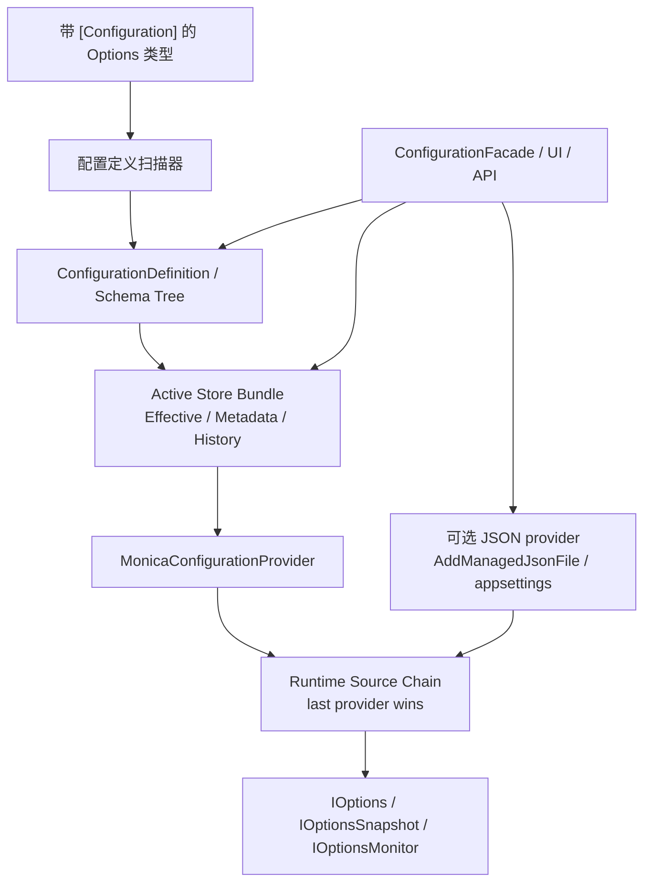

`Monica.Configuration` 是 Monica 的 schema-first 动态配置模块。它从带 `[Configuration]` 的 Options 类型生成配置定义，用一个 active store bundle 保存 Monica 管理的 effective values、metadata 和 history，同时把最终值投影回 Microsoft `IConfiguration` / Options Pattern。

当前设计有两个层次：

- **Monica 管理层**：负责配置定义、effective JSON document、存储、校验、mutation、history、rollback 和 UI 管理体验。
- **Microsoft Configuration 运行时层**：仍然按 provider 顺序决定运行时真正生效的值。Monica 可以检查 source chain，并可修改可解析的 JSON file provider。

这意味着 Monica 不是传统“配置中心服务”。它更像一个配置领域模型：**受管配置值有统一存储和审计；运行时来源链路仍遵守 .NET `IConfiguration` 的 provider 顺序，最后提供 key 的 provider 生效。**

## 何时使用这个模块

- 你希望 Options 类型本身就是配置定义，而不是在宿主里散落大量 `Bind` 代码。
- 你需要在运行期查看、暂存、保存、导入、导出或回滚配置值。
- 你需要单体 file store 或分布式 DB store 来保存 Monica 管理的 effective values、metadata 和 history。
- 你需要在 UI 中解释一个值来自 Monica effective store、JSON 文件、环境变量还是其他 provider。
- 你需要通过 UI 修改 Monica effective store，或修改可写 JSON provider，例如 `appsettings*.json` 或通过 `AddManagedJsonFile(...)` 注册的文件。
- 你希望启动期输入继续由宿主 `builder.Configuration` 提供，而业务代码通过标准 Options 接口消费 Monica 管理的配置。
- 你希望最终消费方式仍然保持 Microsoft `IConfiguration`、`IOptions<T>`、`IOptionsSnapshot<T>` 和 `IOptionsMonitor<T>`。

## 包与注册入口

| 项目 | 值 |
|---|---|
| 核心包 | `Monica.Configuration` |
| EF Core 存储包 | `Monica.Configuration.EfCore` |
| UI 包 | `Monica.Configuration.UI` |
| 核心注册入口 | `MonicaConfigurationInputPlan.Create(...)` + `monica.AddConfiguration(inputPlan)` |
| UI 注册入口 | [`monica.AddConfigurationUI()`](../configuration-ui/index.md) |

## 最小注册

单体或本地模式：

```csharp
var configurationInputPlan = MonicaConfigurationInputPlan.Create(inputs => inputs
    .UseFileConfigurationStore());

builder.AddMonica(monica =>
{
    monica.AddConfiguration(configurationInputPlan);
});
```

分布式模式：

```csharp
var configurationStoreConnectionString =
    builder.Configuration.GetConnectionString("Configuration")
    ?? throw new InvalidOperationException("Missing Configuration connection string.");
var configurationInputPlan = MonicaConfigurationInputPlan.Create(inputs => inputs
    .UseDbConfigurationStore(options =>
        options.UseSqlite(configurationStoreConnectionString)));

builder.AddMonica(monica =>
{
    monica.AddConfiguration(configurationInputPlan);
});
```

需要把某个 JSON 文件作为高优先级可管理来源时：

```csharp
var configurationInputPlan = MonicaConfigurationInputPlan.Create(inputs => inputs
    .UseDbConfigurationStore(options => options.UseSqlite(configurationStoreConnectionString))
    .AddManagedJsonFile(
        "docs-external-settings.json",
        optional: false,
        reloadOnChange: true,
        options =>
        {
            options.DisplayName = "Docs External Demo Settings";
            options.Description = "通过 Monica.Configuration 注册的外部 JSON 来源。";
            options.IsWritable = true;
        }));

builder.AddMonica(monica =>
{
    monica.AddConfiguration(configurationInputPlan);
});
```

`MonicaConfigurationInputPlan` 会一次性冻结 store、section-path convention 和有序 managed JSON sources，再由 `AddConfiguration(inputPlan)` 投影到运行时模块图。`AddManagedJsonFile(...)` 会记录 Monica UI 需要的 display name、path、optional、reloadOnChange、writable 和 description。它默认追加在 Monica effective provider 之后，因此优先级高于 Monica store；如果宿主后续再追加其他 provider，后追加的 provider 仍可覆盖它。

当某个 Monica-managed Option 必须在模块图组合前驱动宿主拓扑时，可由同一个 plan 调用 `BuildBootstrapConfiguration(...)` 和 `LoadEffectiveOptionsSnapshot[Async](...)`。该 API 只返回 point-in-time 启动观察：缺失 document 使用内存 seed，不发布 metadata，也不创建文件或数据库行；真正的持久化 seed 由后续 runtime activation 完成。详见 [Scenarios](./scenarios.md)。

## 稳定定义身份与生命周期

`ConfigurationAttribute.DefinitionKey` 不是必填项。未设置时，Monica 使用 CLR 类型的完整名称。这个约定适合本地应用，但 namespace 或类型改名会形成一个新的配置身份。对于共享 store、长期历史、导入导出或独立部署的服务，建议显式指定一个全局唯一、不会随代码重构变化的 key：

```csharp
[Configuration(
    "Ordering",
    DefinitionKey = "company.ordering.options",
    DisplayName = "Ordering")]
public sealed class OrderingOptions
{
}
```

定义生命周期由当前逻辑发布者推导，不额外持久化一列状态：

- **Active（活动）**：至少一个逻辑服务当前正在发布该定义，或者当前进程注册了匹配的 CLR 定义。
- **Retired（已停用）**：canonical definition 仍保留用于诊断和审计，但当前没有逻辑发布者报告它。

已停用定义不会进入正常运行时解析、mutation、导入导出或统一版本快照，但仍会显示在 Configuration UI 中，供操作员查看发布历史并决定是否清理。以后再次发布相同 key 会自动恢复为活动状态；Monica 不会通过 schema 或显示名称相似度猜测“改名”。

人工清理只允许针对已停用定义，并使用预览时读取的 definition revision 做并发校验。清理会删除 canonical definition、definition publication history 和当前 Monica effective-value document；不可变的 value history、mutation group 和 unified-version snapshot 会继续保留用于审计。执行破坏性操作前应先核对预览中的删除与保留数量。

## 整体架构



## 公开使用面

- `MonicaConfigurationInputPlan.Create(...)`：一次声明 store、section-path convention 和有序 managed JSON sources。
- `monica.AddConfiguration(inputPlan)`：把同一份 plan 应用于 schema 扫描、Options 绑定、runtime provider、mutation、history、rollback、source inspection 和 facade。
- `UseFileConfigurationStore(...)`：在 input plan 上选择单体/本地 file store preset。
- `UseDbConfigurationStore(...)`：在 input plan 上选择分布式 EF Core DB store preset。
- `AddManagedJsonFile(...)`：在 input plan 上追加一个 Monica 可识别的 JSON configuration source，可用于覆盖 Monica effective values。
- `LoadEffectiveOptionsSnapshot[Async](...)`：在运行时激活前只读加载一批 point-in-time Options。
- `ConfigurationAttribute`：把一个 Options 类型声明为 Monica 管理的配置定义。
- `OptionSettingAttribute`：给配置属性添加展示名、说明、敏感值、重载行为和列表项稳定 key。
- `ConfigurationFacade`：UI、Minimal API 或应用层使用的配置管理入口，返回 `Res<T>`。
- `ConfigurationDefinition`、`ConfigurationNodeDefinition`、`LogicalPath`：配置定义、节点 schema 和结构化逻辑路径。

## 关键概念

| 概念 | 用途 |
|---|---|
| `ConfigurationDefinition` | 一个配置类的根定义，包含 `DefinitionKey`、`SectionPath`、`DisplayName`、`ClrTypeName`、`SchemaHash` 和根节点。 |
| `ConfigurationNodeDefinition` | 配置树中的一个节点，可以是 object、dictionary、list 或 scalar。 |
| `LogicalPath` | 运行时修改、历史和 UI 选择使用的结构化路径，不直接等同于 `IConfiguration` 的冒号分隔 key。 |
| `ConfigurationEffectiveValueDocument` | Monica store 中一个 definition 当前最终值的完整 JSON document。 |
| `ConfigurationSourceChain` | 某个配置项在所有 runtime provider 中的贡献链路，按优先级从高到低展示。 |
| `ConfigurationMutationGroup` | 一组配置修改的审计单元，UI 保存时会把多个变更作为一个组提交。 |

## 相关页面

- [Quick Start](./quick-start.md)
- [Concepts](./concepts.md)
- [Configuration](./configuration.md)
- [注册扩展与 Store](./guide-and-providers.md)
- [Scenarios](./scenarios.md)
- [Configuration UI](../configuration-ui/index.md)
