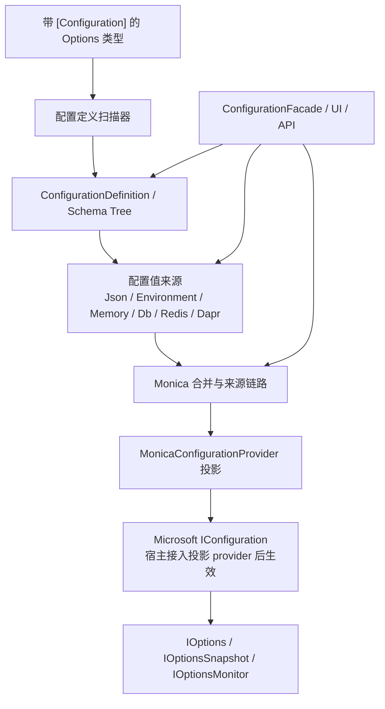

# Configuration

`Monica.Configuration` 是 Monica 的 schema-first 动态配置模块。它从带 `[Configuration]` 的 Options 类型生成配置定义，用统一的源模型读取 Json、环境变量、内存、数据库、Redis 或 Dapr 配置，并提供面向 `IConfiguration` / Options Pattern 的投影层。

它不是一个“配置中心服务”。更准确地说，它提供的是：**共享存储作为事实源，任意服务或 UI 都可以作为写入入口，所有运行实例通过 reload 和通知收敛到同一套配置值。**

## 何时使用这个模块

- 你希望配置类本身就是配置定义，而不是在宿主里散落大量 `Bind` 代码。
- 你需要在运行期查看、暂存、保存或回滚配置值。
- 你要知道某个值来自 Json、环境变量、内存、数据库、Redis 还是 Dapr。
- 你需要对复杂类型进行 schema 级校验，例如 object、dictionary、list 和 scalar。
- 你希望最终消费方式仍然保持 Microsoft `IConfiguration`、`IOptions<T>`、`IOptionsSnapshot<T>` 和 `IOptionsMonitor<T>`。

## 包与注册入口

| 项目 | 值 |
|---|---|
| 包 | `Monica.Configuration` |
| 注册入口 | `Mo.AddConfiguration()` |
| 相关 UI 模块 | [`Mo.AddConfigurationUI()`](../configuration-ui/index.md) |

## 整体架构

## 公开使用面

- `Mo.AddConfiguration()`：注册 schema 扫描、配置源、变更服务、来源链路、历史、回滚和 facade。
- `ConfigurationAttribute`：把一个 Options 类型声明为 Monica 管理的配置定义。
- `OptionSettingAttribute`：给配置属性添加显示名、说明、敏感值、重载行为和列表项稳定 key。
- `ConfigurationFacade`：UI、Minimal API 或应用层使用的配置管理入口，返回 `Res<T>`。
- `ConfigurationDefinition`、`ConfigurationNodeDefinition`、`LogicalPath`：配置定义、节点 schema 和结构化逻辑路径。
- `IConfigurationValueSource`、`IConfigurationHistorySource`、`IConfigurationMutationGroupSource`：配置源、历史源和变更组存储的公共扩展点。

## 关键概念

| 概念 | 用途 |
|---|---|
| `ConfigurationDefinition` | 一个配置类的根定义，包含 `DefinitionKey`、`SectionPath`、`DisplayName`、`ClrTypeName`、`SchemaHash` 和根节点。 |
| `ConfigurationNodeDefinition` | 配置树中的一个节点，可以是 object、dictionary、list 或 scalar。 |
| `LogicalPath` | 运行时修改、历史和 UI 选择使用的结构化路径，不直接等同于 `IConfiguration` 的冒号分隔 key。 |
| `ConfigurationValueOverride` | 某个配置源对某个逻辑路径贡献的值，可以是 scalar leaf，也可以是 container snapshot。 |
| `ConfigurationSourceChain` | 某个逻辑路径的所有来源值和最终生效来源。 |
| `ConfigurationMutationGroup` | 一组配置修改的审计单元，UI 保存时会把多个变更作为一个组提交。 |

## 相关页面

- [Quick Start](./quick-start.md)
- [Concepts](./concepts.md)
- [Configuration](./configuration.md)
- [Guide and Providers](./guide-and-providers.md)
- [Scenarios](./scenarios.md)
- [Configuration UI](../configuration-ui/index.md)
