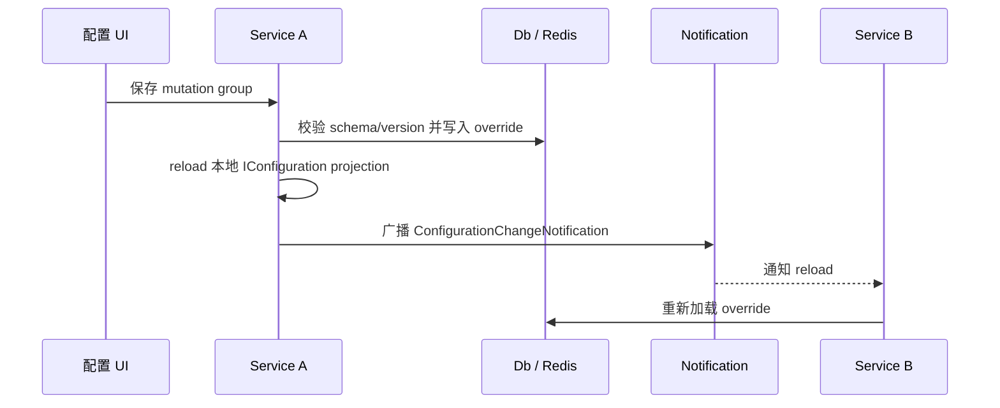

# Scenarios

## 场景 1 — 用配置类统一 Options 注册

把配置类放在拥有它的业务模块或基础设施模块中，并用 `[Configuration]` 声明配置定义。宿主只需要注册 `Mo.AddConfiguration()`，不需要逐个写 `services.Configure<TOptions>(...)`。

```csharp
[Configuration(
    "Messaging:MailSender",
    DefinitionKey = "mail.sender",
    DisplayName = "Mail Sender",
    OwnerModule = "Messaging")]
public sealed class MailSenderOptions
{
    [Required]
    [OptionSetting("From Address")]
    public string FromAddress { get; set; } = "";

    [OptionSetting("SMTP", Description = "SMTP endpoint settings.")]
    public SmtpOptions Smtp { get; set; } = new();
}
```

## 场景 2 — 使用 UI 暂存并保存一组修改

`Mo.AddConfigurationUI()` 会提供配置状态页。操作员可以修改多个配置项，然后作为一个 mutation group 保存。保存时会：

1. 创建 `ConfigurationMutationGroup`。
2. 对每个 staged change 调用 `ConfigurationFacade.MutateAsync(...)`。
3. 完成或标记部分成功的 mutation group。
4. 触发本进程 reload，并通过已注册的 notification broadcaster 通知其他实例。

## 场景 3 — 在数据库中持久化配置和历史

默认 memory source 适合开发和演示，但进程重启后不会保留修改。生产环境通常启用 EF Core provider：

```csharp
Mo.AddConfiguration()
    .UseEfCoreConfigurationStore((serviceProvider, options) =>
    {
        options.UseSqlServer(builder.Configuration.GetConnectionString("Configuration"));
    });
```

EF Core provider 会发布当前服务拥有的 schema，并持久化 override、history、source state 和 mutation group。

## 场景 4 — 复杂类型：Dictionary + List + 嵌套对象

```csharp
public sealed class GatewayOptions
{
    [OptionSetting("Services")]
    public Dictionary<string, ServiceOptions> Services { get; set; } = [];
}

public sealed class ServiceOptions
{
    [OptionSetting("Connected Databases")]
    public List<ConnectedDbOptions> ConnectedDbs { get; set; } = [];
}

public sealed class ConnectedDbOptions
{
    [Required]
    [OptionSetting("Name", IsListItemKey = true)]
    public string Name { get; set; } = "";

    [Required]
    [OptionSetting("Connection String", IsSensitive = true)]
    public string ConnectionString { get; set; } = "";
}
```

修改 `Services[$billing].ConnectedDbs[#main].ConnectionString` 时，dictionary key 是 `billing`，list item key 是 `main`。如果该服务节点已经以 container snapshot 存储，Monica 会 patch snapshot；否则可以写入叶子 override。

## 场景 5 — 分布式写入入口

多个微服务都可以注入 `ConfigurationFacade` 或暴露自己的管理入口发起 mutation。架构不是 CRDT 式去中心化存储，而是：

- 存储是单一事实源，例如 DB 或 Redis。
- 写入入口可以分散到多个服务或 UI。
- 并发控制依赖 value version 和 schema version。
- 通知是 best-effort；错过通知的实例可在下一次 provider reload 或下一次 mutation 后重新收敛。



## Common mistakes

- 用类短名作为 `DefinitionKey`。跨服务系统里建议使用稳定、全局唯一、不会随命名空间调整轻易变化的 key。
- 把 `LogicalPath` 当作手写字符串处理。应用代码应使用 `LogicalPath.FromProperties(...)` 或 segment 类型构造路径。
- 期望 Dapr Configuration source 可写。当前 Dapr source 是 read-only。
- 没有给 list item 配置稳定 key，却希望按项修改 list。
- 把 `IsSensitive` 当成权限控制。它只负责存储保护和展示脱敏，不替代认证授权。
- 只使用默认 memory source 就期望重启后保留修改和历史。生产持久化应接入 EF Core、Redis 或自定义 source。
