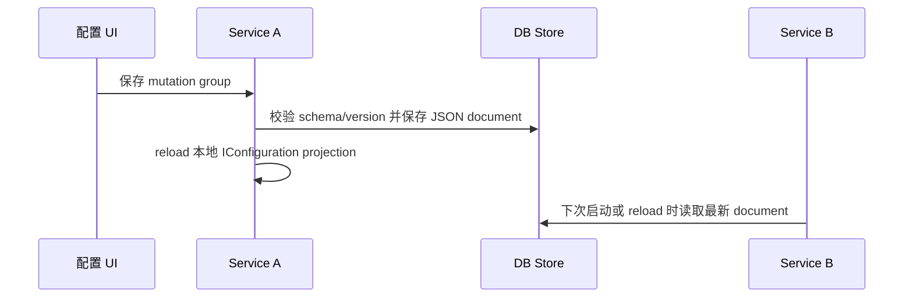

## 场景 1 — 用配置类统一 Options 注册

把配置类放在拥有它的业务模块或基础设施模块中，并用 `[Configuration]` 声明配置定义。宿主先用一个 input plan 显式选择 store，再把同一 plan 交给 Configuration 模块。

```csharp
var configurationInputPlan = MonicaConfigurationInputPlan.Create(inputs => inputs
    .UseFileConfigurationStore());

builder.AddMonica(monica =>
{
    monica.AddConfiguration(configurationInputPlan);
});
```

```csharp
[Configuration(
    "Messaging:MailSender",
    DefinitionKey = "mail.sender",
    DisplayName = "Mail Sender",
    Category = "Messaging")]
public sealed class MailSenderOptions
{
    [Required]
    [OptionSetting("From Address")]
    public string FromAddress { get; set; } = "";

    [OptionSetting("SMTP", Description = "SMTP endpoint settings.")]
    public SmtpOptions Smtp { get; set; } = new();
}
```

## 场景 2 — 分布式配置使用 DB store

分布式部署应使用 DB store，让所有实例共享同一个 Monica-managed effective value、metadata 和 history 事实源：

```csharp
var configurationStoreConnectionString =
    builder.Configuration.GetConnectionString("Configuration")
    ?? throw new InvalidOperationException("Missing Configuration connection string.");
var configurationInputPlan = MonicaConfigurationInputPlan.Create(inputs => inputs
    .UseDbConfigurationStore(options =>
        options.UseSqlServer(configurationStoreConnectionString)));

builder.AddMonica(monica =>
{
    monica.AddConfiguration(configurationInputPlan);
});
```

数据库连接串和 migration availability 属于读取 store 自身的前置条件，必须来自宿主原生 `IConfiguration` 或部署系统，不能依赖该 store 内的 Monica effective values。

## 场景 3 — 读取只读的启动期 Options 快照

当少数 Monica-managed Options 必须在 DI 容器或模块图构建前驱动宿主拓扑时，复用同一份 input plan 加载 point-in-time snapshot。不要为此提前构建临时 DI 容器。

```csharp
var configurationStoreConnectionString =
    builder.Configuration.GetConnectionString("Configuration")
    ?? throw new InvalidOperationException("Missing Configuration connection string.");
var configurationInputPlan = MonicaConfigurationInputPlan.Create(inputs => inputs
    .UseDbConfigurationStore(options =>
        options.UseSqlServer(configurationStoreConnectionString)));

using var bootstrap = configurationInputPlan.BuildBootstrapConfiguration(builder);
var startupSnapshot = await configurationInputPlan.LoadEffectiveOptionsSnapshotAsync(
    bootstrap,
    [typeof(AppOptions)]);
var startupAppOptions = startupSnapshot.Get<AppOptions>();

builder.AddMonica(monica =>
    monica.AddConfiguration(configurationInputPlan));

public sealed class AppSettingsReader(IOptionsSnapshot<AppOptions> options)
{
    public AppOptions Current => options.Value;
}
```

Snapshot 对请求类型去重后只执行一次 ordered batch read，优先级为 host configuration → stored Monica document 或缺失时的内存 seed → managed JSON；后声明的 managed JSON 优先级更高。它不会发布 metadata，也不会创建或更新 file/database document。Reader failure、取消、malformed JSON、projection failure 和 binding failure 都是 fatal，只有 document 确实缺失时才使用 seed。

Snapshot 与稍后的 runtime configuration 之间没有 consistency barrier。Store edit、purge 或 runtime activation 持久化不同 seed 后，运行时值可以不同；后者才负责发布 metadata 和创建缺失 document。影响拓扑的设置应声明 `StaticAfterStartup` 或 `RequiresRestart`。普通业务代码仍在运行时通过标准 Options Pattern 消费值。

## 场景 4 — 注册外部 JSON 文件作为覆盖来源

有些配置需要继续由文件交付或现场维护，例如连接串覆盖、客户现场参数或低频运维开关。可以使用 `AddManagedJsonFile(...)`：

```csharp
var configurationInputPlan = MonicaConfigurationInputPlan.Create(inputs => inputs
    .UseDbConfigurationStore(options => options.UseSqlite(configurationStoreConnectionString))
    .AddManagedJsonFile(
        "docs-external-settings.json",
        optional: false,
        reloadOnChange: true,
        options =>
        {
            options.DisplayName = "Docs External Demo Settings";
            options.Description = "Operator-managed JSON file registered through Monica.Configuration.";
            options.IsWritable = true;
        }));

builder.AddMonica(monica =>
{
    monica.AddConfiguration(configurationInputPlan);
});
```

示例 JSON：

```json
{
  "Demo": {
    "DocumentationPortal": {
      "PortalTitle": "External JSON Docs Portal",
      "SearchPageSize": 48,
      "Security": {
        "ClientId": "monica-docs-external-json"
      }
    }
  }
}
```

该文件优先级高于 Monica effective store。UI 中对应配置项会显示当前值来自 `Docs External Demo Settings`。如果该文件可写，修改配置项会写回这个 JSON 文件，并在 history 中记录 `TargetKind = ExternalConfigurationSource`。示例中的 `reloadOnChange: true` 只用于 runtime provider；bootstrap 与 startup snapshot provider 始终禁用 watcher。

## 场景 5 — 查看 source chain 排查“为什么不是我刚改的值”

当某个值被外部 provider 覆盖时，直接看 Monica effective document 可能会误判。应查看 source chain：

| Source | Priority | Value | Effective |
|---|---:|---|---|
| `Docs External Demo Settings` | 高 | `External JSON Docs Portal` | 是 |
| `Monica Effective Store` | 中 | `Monica Operator Docs` | 否 |
| `appsettings.json` | 低 | `Bootstrap Docs` | 否 |

如果修改 Monica store 后运行时值没有变化，通常是因为更高优先级 provider 仍然提供同一个 key。UI 会在保存预览和来源详情中提示目标 source。

## 场景 6 — 使用 UI 暂存并保存一组修改

`monica.AddConfigurationUI()` 会提供配置状态页。操作员可以修改多个配置项，然后作为一个 mutation group 保存。保存时会：

1. 创建 `ConfigurationMutationGroup`。
2. 对每个 staged change 调用 `ConfigurationFacade.MutateAsync(...)` 或 `MutateSourceAsync(...)`。
3. Patch Monica effective document 或外部 JSON file。
4. 写入 mutation history。
5. 完成或标记部分成功的 mutation group。
6. 触发本进程 reload，并调用已注册的 `IConfigurationChangeNotifier`。

无效输入不会进入 saveable pending changes，而是进入 validation issue 列表。保存对话框会显示错误原因、规则说明和跳转按钮；只要存在 validation issue，就不能保存该组修改。

## 场景 7 — 复杂类型：Dictionary + List + 嵌套对象

```csharp
public sealed class GatewayOptions
{
    [OptionSetting("Services")]
    public Dictionary<string, ServiceOptions> Services { get; set; } = [];
}

public sealed class ServiceOptions
{
    [OptionSetting("Connected Databases")]
    public List<ConnectedDbOptions> ConnectedDbs { get; set; } = [];
}

public sealed class ConnectedDbOptions
{
    [Required]
    [OptionSetting("Name", IsListItemKey = true)]
    public string Name { get; set; } = "";

    [Required]
    [OptionSetting("Connection String", IsSensitive = true)]
    public string ConnectionString { get; set; } = "";
}
```

修改 `Services[$billing].ConnectedDbs[#main].ConnectionString` 时，dictionary key 是 `billing`，list item key 是 `main`。存储层仍然保存整份 effective JSON document；Monica 按路径 patch 文档中的目标值。

复杂节点编辑默认压缩为 container mutation。例如编辑 `Services[$billing]` 会保存为一条 `Set Services[$billing]`，历史详情用 diff 展示字段级变化。

## 场景 8 — 带集合默认值的 Options 绑定

配置类可以为集合提供安全默认值。只要宿主配置显式提供了对应集合 section，Monica 绑定时会把该集合视为“配置替换默认值”，而不是把配置项追加到默认集合后面。

```csharp
[Configuration("Search")]
public sealed class SearchOptions
{
    public List<string> Providers { get; set; } = ["local"];

    public SearchUiOptions Ui { get; set; } = new();
}

public sealed class SearchUiOptions
{
    public List<string> Tabs { get; set; } = ["overview"];
}
```

宿主配置：

```json
{
  "Search": {
    "Providers": [ "database" ],
    "Ui": {
      "Tabs": [ "results" ]
    }
  }
}
```

运行时通过 `IOptions<SearchOptions>` 读取到的结果是：

| Property | Runtime value |
|---|---|
| `Providers` | `[ "database" ]` |
| `Ui.Tabs` | `[ "results" ]` |

如果配置中完全没有 `Search:Providers`，则 `Providers` 保持 CLR 默认值 `[ "local" ]`。这个规则同样适用于 dictionary、array 和嵌套对象中的集合。它只影响 Options 绑定语义；列表项的运行期 mutation 仍然建议使用 `OptionSettingAttribute.IsListItemKey` 提供稳定 item key。

## 场景 9 — 参数导入导出

导出用于备份、交付或同步环境：

- 默认导出所有 Monica-managed definitions。
- 可以选择只导出当前 definition。
- 敏感值默认 redacted；显式选择后才会包含敏感值。
- 导出文件包含 schema version/hash、source summary、value version、导出时间、操作人、系统版本和环境名。

导入不会直接写入 store。流程是：

1. 上传 `.json` 导出文件。
2. UI 解析并生成报告：changed、unchanged、unknown definition/path、schema mismatch、read-only source、validation issue、redacted skip。
3. 用户确认后，合法变更进入配置状态页暂存。
4. 最终仍然通过保存 mutation group 提交。

导入目标是“当前生效且可写的 source”。如果当前值由只读 provider 覆盖，导入会报告问题，而不是偷偷写 Monica store。

## 场景 10 — 分布式写入入口

多个微服务都可以注入 `ConfigurationFacade` 或暴露自己的管理入口发起 mutation。架构不是 CRDT 式去中心化存储，而是：

- 存储是单一事实源，例如 DB。
- 写入入口可以分散到多个服务或 UI。
- 并发控制依赖 value version、source revision 和 schema version。
- v1 不提供内置跨服务热重载；只保留 `IConfigurationChangeNotifier` 抽象，后续可由具体 provider 实现。



## Common mistakes

- 用类短名作为 `DefinitionKey`。跨服务系统里建议使用稳定、全局唯一、不会随命名空间调整轻易变化的 key。
- 把 `LogicalPath` 当作手写字符串处理。应用代码应使用 `LogicalPath.FromProperties(...)` 或 segment 类型构造路径。
- 直接从 `monica.AddConfiguration()` 链接 store 或 managed JSON。应先在 `MonicaConfigurationInputPlan` 上声明输入，再调用 `monica.AddConfiguration(inputPlan)`。
- 期望 Monica store 修改一定会成为运行时最终值。更高优先级的 JSON、环境变量或命令行 provider 仍然可以覆盖它。
- 期望所有 provider 都能写。v1 只支持 Monica effective store 和可解析 physical path 的 JSON file provider。
- 没有给 list item 配置稳定 key，却希望按项修改 list。
- 把 `IsSensitive` 当成权限控制。它只负责展示脱敏，不替代认证授权。
