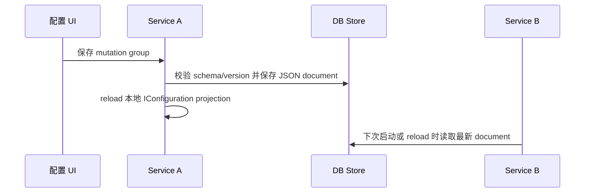

# Scenarios

## 场景 1 — 用配置类统一 Options 注册

把配置类放在拥有它的业务模块或基础设施模块中，并用 `[Configuration]` 声明配置定义。宿主需要注册 `Mo.AddConfiguration()`，并显式选择 file 或 DB store。

```csharp
Mo.AddConfiguration()
    .UseFileConfigurationStore();
```

```csharp
[Configuration(
    "Messaging:MailSender",
    DefinitionKey = "mail.sender",
    DisplayName = "Mail Sender",
    OwnerModule = "Messaging")]
public sealed class MailSenderOptions
{
    [Required]
    [OptionSetting("From Address")]
    public string FromAddress { get; set; } = "";

    [OptionSetting("SMTP", Description = "SMTP endpoint settings.")]
    public SmtpOptions Smtp { get; set; } = new();
}
```

## 场景 2 — 使用 UI 暂存并保存一组修改

`Mo.AddConfigurationUI()` 会提供配置状态页。操作员可以修改多个配置项，然后作为一个 mutation group 保存。保存时会：

1. 创建 `ConfigurationMutationGroup`。
2. 对每个 staged change 调用 `ConfigurationFacade.MutateAsync(...)`。
3. Patch 对应 definition 的 effective JSON document。
4. 写入 mutation history。
5. 完成或标记部分成功的 mutation group。
6. 触发本进程 reload，并调用已注册的 `IConfigurationChangeNotifier`。

## 场景 3 — 分布式配置使用 DB store

分布式部署应使用 DB store，让所有实例共享同一个 effective value、metadata 和 history 事实源：

```csharp
Mo.AddConfiguration()
    .UseDbConfigurationStore((serviceProvider, options) =>
    {
        options.UseSqlServer(builder.Configuration.GetConnectionString("Configuration"));
    });
```

数据库连接串属于 bootstrap 配置，必须来自宿主原生 `IConfiguration`。服务启动前还无法读取 Monica-managed configuration，因此 DB store 自身的连接信息不能放进 Monica effective values。

## 场景 4 — 复杂类型：Dictionary + List + 嵌套对象

```csharp
public sealed class GatewayOptions
{
    [OptionSetting("Services")]
    public Dictionary<string, ServiceOptions> Services { get; set; } = [];
}

public sealed class ServiceOptions
{
    [OptionSetting("Connected Databases")]
    public List<ConnectedDbOptions> ConnectedDbs { get; set; } = [];
}

public sealed class ConnectedDbOptions
{
    [Required]
    [OptionSetting("Name", IsListItemKey = true)]
    public string Name { get; set; } = "";

    [Required]
    [OptionSetting("Connection String", IsSensitive = true)]
    public string ConnectionString { get; set; } = "";
}
```

修改 `Services[$billing].ConnectedDbs[#main].ConnectionString` 时，dictionary key 是 `billing`，list item key 是 `main`。存储层仍然保存整份 `GatewayOptions` effective JSON document；Monica 按路径 patch 文档中的目标值。

## 场景 5 — 分布式写入入口

多个微服务都可以注入 `ConfigurationFacade` 或暴露自己的管理入口发起 mutation。架构不是 CRDT 式去中心化存储，而是：

- 存储是单一事实源，例如 DB。
- 写入入口可以分散到多个服务或 UI。
- 并发控制依赖 value version 和 schema version。
- v1 不提供内置跨服务热重载；只保留 `IConfigurationChangeNotifier` 抽象，后续可由具体 provider 实现。



## Common mistakes

- 用类短名作为 `DefinitionKey`。跨服务系统里建议使用稳定、全局唯一、不会随命名空间调整轻易变化的 key。
- 把 `LogicalPath` 当作手写字符串处理。应用代码应使用 `LogicalPath.FromProperties(...)` 或 segment 类型构造路径。
- 只调用 `Mo.AddConfiguration()`，却没有选择 `UseFileConfigurationStore(...)` 或 `UseDbConfigurationStore(...)`。
- 期望修改会回写 `appsettings.json`。`appsettings` 只用于 bootstrap/seed，不是 Monica runtime store。
- 没有给 list item 配置稳定 key，却希望按项修改 list。
- 把 `IsSensitive` 当成权限控制。它只负责展示脱敏，不替代认证授权。
